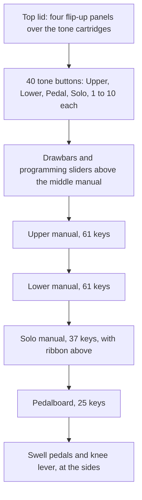
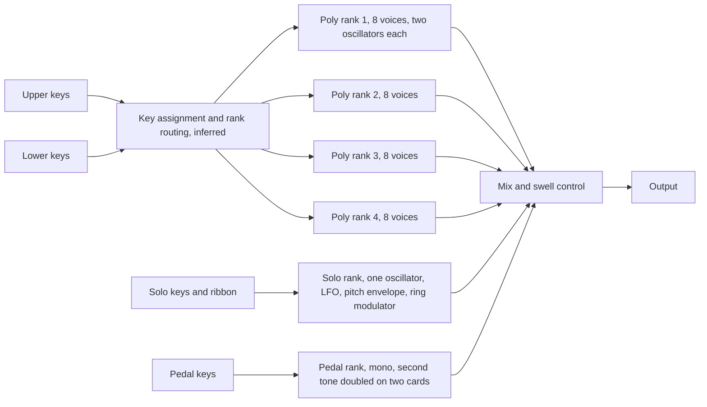

# Yamaha CS-80 — Hardware-Accurate Emulation Compendium

Oct 4, 2026 · @Søren

## 1. Purpose, scope, and how to read this document

This compendium supports a **circuit-informed** CS-80 emulation: 8 voices × 2 complete synth lines (16 voice cards), each built from Yamaha custom ICs, feeding a mono mixer, a monophonic ring modulator and a BBD chorus/tremolo. The goal is to reproduce the interactions that make the instrument sound like itself (HPF→LPF bandpass that tracks the envelope at different rates, damped non-self-oscillating SVF resonance, the IL/AL filter envelope, polyphonic force-sensed touch, per-card drift) rather than a generic two-layer polysynth.

**Confidence legend** used in every component and parameter table:

| Tag | Meaning |
| --- | --- |
| sourced | Stated in a primary or technically reliable source read for this document (Yamaha, service-manual-derived analysis, measured emulator documentation) |
| inferred | Follows from sourced topology or behaviour but no source states the number |
| approx. | An estimate or a second-hand figure; tune against hardware before trusting |
| unknown | No source found; must be measured |

**Evidentiary position.** Closer to the BD-2 compendium than the Magus one: the factory service manual exists (David Rogoff's scan, 67 pages) and an independent block-by-block circuit walkthrough exists (Joachim Milson's interactive diagram). However, the scans are images that the first research pass could not read; a later pass read the parts lists and selected circuit pages from the user's copy, the IG-series chips are undocumented customs, and the most rigorous filter analysis (ModWiggler, 2019) was only reachable second-hand. Numbers from that route are tagged approx.

**Key facts at a glance**

| Item | Value | Confidence |
| --- | --- | --- |
| Production | 1977–1980, fewer than 800 units (serials #1001 to about #1791) | sourced |
| Launch price | US$6,900 / £4,950 / ¥1,280,000 | sourced |
| Weight, size | 82 kg; 1,206 × 681 × 295 mm (Yamaha) | sourced |
| Polyphony | 8 voices, each = 2 independent synth lines (I, II) | sourced |
| Per line | 1 VCO (saw core) → waveshaper → 12 dB HPF → 12 dB LPF → VCA, plus sine and noise | sourced |
| Keyboard | 61 keys, semi-weighted, force-sensing resistor per key, velocity + polyphonic aftertouch | sourced |
| Pitch law | Linear Hz/V VCO; exponential conversion done digitally-assisted on the KAS board | sourced |
| Output | Mono sum, then ring mod, wah, EXP, chorus/tremolo → L, R, General (mono) | sourced |

**How this document separates hardware from features.** Section 9 lists the faithful behaviour first and puts every non-original convenience (MIDI, patch memory, sync, stereo pan, oversampling choices) in a clearly labelled "added features" table. Section 11 lists the myths corrected here.

Where to start for implementation. Section 14 is the build-ready specification: signal model, parameter defaults, the decoded factory presets and a milestone plan. Section 13 holds the service-manual transcription it is derived from. Sections 6 and 9 give component and algorithm options, section 10 the open questions.

## 2. History, production revisions and prices

The CS-80 is the flagship of Yamaha's 1977 CS polysynth trio (CS-50 four voices, CS-60 eight voices single line, CS-80 eight voices dual line). It descends from the GX-1 (1973–75, under 100 made, about US$60,000) and the SY-1/SY-2 monosynths, which share its colour-coded panel language and IL/AL filter envelope. The CS-50, CS-60 and CS-80 share the same voice card; the boards differ only by five resistors and three trimmers per model ([Secret Life of Synthesizers](https://secretlifeofsynthesizers.com/the-vco/)). Production ended in 1980, overtaken by lighter, digitally memorised polysynths such as the Prophet-5.

**Production run and serial numbers**

| Serial range | What is known | Confidence |
| --- | --- | --- |
| #1001 | First production serial; CS-50, CS-60 and CS-80 all started at #1001 | sourced (owner/collector data, Gearspace) |
| #1001–#1169 | Reported to lack the factory pitch-stabilisation (VCO heater-diode) modification | unverified (single comment, Synthtopia) |
| E-46 retrofit | Yamaha service note E-46: a diode bonded to each IG00153 VCO with thermal compound, "to stabilize pitch" | sourced |
| #1306, #1705, #1763 | Individual surviving units cited by owners and dealers | sourced (listings) |
| about #1791 | Highest known serial (per CS-80 specialist Kent Spong), sold early 1980 | sourced, second-hand |
| No serial | Pre-production or prototype units exist; the claimed Vangelis "Spiral" unit had none | unverified |

Total production is therefore about 790 units. **Myth corrected:** Attack Magazine's "around 2,000 sold" is contradicted by serial data; 2,000+ is a plausible figure for the CS-50 (serials to about #2940), not the CS-80.

**Factory VCO ranking.** Every IG00153 was tested at the factory and marked with a temperature-drift "rank" sticker (for example "63"). All VCO chips in one instrument had to be within two rank numbers of each other. This matters for emulation: inter-voice drift is bounded by design, not random.

**Physical and electrical specifications**

| Spec | Value | Confidence |
| --- | --- | --- |
| Dimensions | 1,206 (W) × 681 (D) × 295 (H) mm | sourced (Yamaha) |
| Weight | 82 kg bare; about 100 kg / 220 lb with lid, stand and castors | sourced; the 220 lb figure includes accessories |
| Power consumption | 180 W | sourced |
| Cards | 35 cards in the hinged card cage, 16 of them voice ("M") cards; 5 keyboard boards under the keybed | sourced |
| Internal CMOS rails | +8.5 V and −6.5 V (KAS/SH logic) | sourced |
| Trigger levels (KAS) | +8.5 V idle, −6.5 V active (active low) | sourced |
| Outputs | Left, Right, General (mono), Phones; L = R unless chorus/tremolo is on | sourced |

**Prices over time**

| Date | Price | Context | Source |
| --- | --- | --- | --- |
| Aug 2026 | £401,465.62 (about US$534,000) | Unit claimed to be Vangelis's first, no serial, no documentation; record synth sale | DJ Mag, EDM.com |
| 2025–2026 | about US$60,000 asking | Excellent original unit, serial #1705 | Bernunzio listing |
| Oct 2016 | £14,900 | Fully operationally restored by KSR (Kent Spong) | RL Music |
| Jan 2016 | £14,500 | Restored, with MIDI and Unison mods | RL Music |
| 1977 | US$6,900 / £4,950 / ¥1,280,000 | Launch list price | Wikipedia, Yamaha |

Restoration itself is a significant cost: KSR's "Level 1" operational restoration (all CMOS logic, all dual op-amps, voice-card and PSU capacitors and transistors) was quoted at about £3,000 in 2016.

**Myths corrected here.** "Released in 1976" (Reverb Machine, some wiki mirrors): Yamaha's chronology and the NAMM June 1977 debut put it in 1977. "Made in '73" (Empire of the Sun quote): impossible; 1973 is the GX-1. "World's first true polysynth" (Hollow Sun): the GX-1, Oberheim Four-Voice and Polymoog all precede it; the CS-80's real distinction is fully independent dual-line voices with polyphonic touch.

## 3. Anecdotes and famous uses

Vangelis is the defining user; most other attributions are credible but rest on secondary write-ups, so each row carries a verification status. Use these recordings as tonal references for validation (section 10), weighting the "verified" rows highest.

| Artist / work | Use | Status | Source |
| --- | --- | --- | --- |
| Vangelis, *Spiral* (1977) | First CS-80 use; used for the rest of his career | Verified | Wikipedia; DJ Mag |
| Vangelis, *Chariots of Fire* (1981), *Blade Runner* (1982) | Main instrument; poly aftertouch swells and ribbon glides (e.g. "Memories of Green") | Verified | Secret Life of Synthesizers; Reverb Machine |
| Vangelis, E&MM interview, Dec 1984 | Called it the most important synth of his career and the best analogue design ever; said it needs a lot of practice | Verified (primary interview) | [Muzines](https://www.muzines.co.uk/articles/soil-festivities/8038) |
| Michael Jackson, "Billie Jean", "Human Nature" (1982) | String vamp on "Billie Jean" said to be played by Jackson on a CS-80 in one take; Steve Porcaro's "Human Nature" intro with glissando | Partly verified: quote is unattributed in Reverb Machine | Reverb Machine |
| Toto, *Toto IV* (1982), "Africa" | Brass-like chord pad | Unverified (widely repeated, no primary source read) | Reverb Machine |
| Paul McCartney, "Wonderful Christmastime" (1979) | Chord stabs with sub-osc saw-down filter rhythm | Disputed: a Prophet-5 appears in the video | Reverb Machine; Wikipedia |
| Bruce Springsteen / Roy Bittan, "Born in the U.S.A." (1984) | Main synth horn line; Bittan toured with a CS-80 | Verified via BBC *Sound of Song* | Reverb Machine |
| Don Airey (Ozzy Osbourne, *Blizzard of Ozz*) | Praised its French horn, strings and bass end in 1982 | Quote verified (Keyboard, 1982); per-track use unverified | Reverb Machine |
| Kate Bush | Main keyboard before the Fairlight | Secondary | Reverb Machine |
| Peter Howell, *Doctor Who* theme (1980) | Listed by Wikipedia | Unverified | Wikipedia |
| Genesis (*Duke*), ELO ("Here Is the News"), Wire (*154*), Steve Winwood (*Arc of a Diver*), Jean-Michel Jarre | Listed users | Unverified | Wikipedia (mirror) |
| Squarepusher, *Ufabulum* (2012); Metric, *Pagans in Vegas*; Empire of the Sun | Modern users; Empire of the Sun admit their unit was badly out of tune on the first album | Quotes verified (SOS for Squarepusher) | Reverb Machine |
| Hans Zimmer / Benjamin Wallfisch, *Blade Runner 2049* | Recorded on a CS-80 in the studio | Verified (SoundWorks video) | Reverb Machine |

**Anecdotes useful to an emulator designer**

- *The record sale.* In August 2026 a CS-80 claimed to be Vangelis's first sold on Reverb for £401,465.62. It had no serial (described as an "early prototype"), no documentation and a cigarette burn on an A key. Provenance is unverified.
- *Customised presets.* Some artists reportedly had techs change the resistor values on the preset (T-matrix) boards to make new fixed presets. Unverified, but plausible given the resistor-matrix design (section 4).
- *Live use.* The CS-80 shipped with castors, but technicians describe it as unsuited to touring: trimmers slip in transit and a full calibration is needed. Secret Life of Synthesizers nonetheless reports a full show with only a quick touch-up beforehand.
- *Workshop folklore.* A repair tech recalls that whenever a CS-80 came in, everyone wanted to play it, unlike other synths (VCV forum). The same post's technical claims are wrong (see section 11).

## 4. Interface: every control, range, taper and storage

All front-panel controls are analog potentiometers or switches; nothing is digitised except key assignment, key-to-voltage conversion and glissando stepping. There is no parameter quantisation to emulate except the six-position Feet switch and the semitone glissando. Ranges below in volts or percent are sourced; most time and frequency end-stops are **unknown** and must be measured.

**Physical conventions (sourced).** Programming sliders: colour-coded (green filter, red resonance, white pitch, grey amplitude, yellow sustain/release, black other). Performance "paddles" were taken from Yamaha organs and run backwards: fully up is off, and the amount increases as the paddle is pulled toward the player. Rocker switches are on in the down position. Replacement slide pots are sold as B10K and C10K types, which in Japanese nomenclature means linear and reverse-log tapers (inferred mapping; which control uses which is unknown).

### 4.1 Per-line controls (two identical rows, line I and line II)

| Block | Control | Range / positions | Taper | Confidence |
| --- | --- | --- | --- | --- |
| VCO | Feet | 6 positions: 16′, 8′, 5⅓′, 4′, 2⅔′, 2′ (octave below, unison, fifth, octave, octave+fifth, two octaves) | Stepped switch | sourced (SOS Arturia review; Cherry docs list 8 positions, 2 of which are GX-1 only) |
| VCO | PW | 50% (square) to 90% | Slider, taper unknown | sourced |
| VCO | PWM depth | 0 to max; per-line PWM LFO, free-running, independent per line | Slider | sourced |
| VCO | PWM Speed | Rate of the per-line PWM LFO; Hz range unknown | Slider | range unknown |
| VCO | Saw, Square | On/off rockers (down = on) | Switch | sourced |
| VCO | Noise | Level of white noise into the filters | Slider | sourced |
| VCF | HPF cutoff | Sets HPF "sustain" frequency; Hz range unknown | Slider | range unknown |
| VCF | Res H | HPF damping; never reaches self-oscillation | Slider | sourced (behaviour) |
| VCF | LPF cutoff | Sets LPF "sustain" frequency | Slider | range unknown |
| VCF | Res L | LPF damping | Slider | sourced (behaviour) |
| VCF EG | IL (initial level) | 0 to −5 V below the cutoff setting; slider travel feels inverted | Slider | sourced (Cherry Audio, measured) |
| VCF EG | AL (attack level) | 0 to +5 V above the cutoff setting | Slider | sourced (Cherry Audio) |
| VCF EG | A, D, R | IC limits (page 42): attack 1 ms to 1 s, decay 10 ms to 10 s, release 10 ms to 10 s; slider mapping unknown | Slider | unknown |
| VCA | VCF level | Filtered signal into the VCA | Slider | sourced |
| VCA | Sine level | Waveshaper sine added after the filters; slightly impure | Slider | sourced |
| VCA | A, D, S, R | Conventional ADSR; times unknown | Slider | unknown |
| Touch | Level | Baseline VCA gain at lightest touch | Slider | sourced |
| Touch | Initial Level, After Level | Velocity and aftertouch depth to a separate dynamics VCA | Slider | sourced |
| Touch | Initial Brilliance, After Brilliance | Velocity and aftertouch depth to both filter cutoffs | Slider | sourced |

### 4.2 Performance and global controls (above the keyboard)

| Control | Function | Confidence |
| --- | --- | --- |
| Master pitch | ±1 semitone (Cherry Audio figure) | approx. |
| Detune | Detunes line II against line I; linear (Hz) detune in the key-voltage path | sourced (topology) |
| Mix | Crossfade line I ↔ line II | sourced |
| Brilliance (overall) | Adds/subtracts from both filter cutoffs of both lines; it is an offset, not a separate filter | sourced |
| Resonance (overall) | Adds to both resonances of both lines | sourced |
| Sub Osc: Function | Global LFO waveform; Cherry lists sine, saw, inverted saw, square, sample and hold, noise | sourced via emulator; original label set should be checked against the owner's manual |
| Sub Osc: Speed | Reaches well into the audio range | sourced (behaviour), range unknown |
| Sub Osc: VCO, VCF, VCA | Depth to pitch, both cutoffs, amplitude | sourced |
| Touch Response: Pitch Bend | Velocity-scaled initial pitch scoop from below; scoop speed constant | sourced |
| Touch Response: Sub Osc After (Speed, VCO, VCF) | Polyphonic aftertouch raises LFO speed and depths | sourced |
| Keyboard Control: Brilliance Low/High, Level Low/High | Cutoff and level key-scaling, neutral at centre octave, bipolar | sourced |
| Ring Mod: Attack, Decay, Depth | One AD envelope sweeping ring-mod frequency; monophonic, retriggers only after all keys are released | sourced |
| Ring Mod: Speed, Modulation | Base frequency and depth | sourced |
| Ribbon | Pitch; starts from wherever first touched (no fixed centre); can sweep below audio | sourced |
| Tone selector | 2 rows × 14 lit buttons: 11 presets, 2 memories, 1 Panel per line | sourced |

### 4.3 Left-hand panel and pedals

| Control | Behaviour | Confidence |
| --- | --- | --- |
| Sustain I / II | I: each released note fades independently. II: last note/chord carries sustain; a new note silences fading ones. Also changes whether the ribbon bends sustained notes | sourced |
| Sustain time | Added to VCA release while the pedal is down; released notes always decay | sourced |
| Portamento / Glissando | Polyphonic, digitally managed: each voice glides from the last played note; glissando steps in semitones (YM26700), then a simple low-pass smooths it | sourced |
| Porta/Gliss time | Slider; minimum = off | sourced |
| Chorus / Tremolo | Rockers and speed/depth; BBD-based, stereo only when engaged | sourced |
| Expression pedal | Volume (EXP) and/or a separate wah circuit | sourced |

### 4.4 How sounds are stored

There is no digital memory. The 22 presets (11 per line) live on tone-matrix boards T51–T54 as fixed resistor sets that replace the panel pots. The four memories (M1, M3 for line I; M2, M4 for line II) are miniature slider panels under a hinged lid, duplicating one line's programming controls each. Selecting a memory routes its mini-pots instead of the panel. Consequence for emulation: preset and memory recall are instantaneous resistor swaps, so parameter changes are steps, not glides, and performance paddles are never stored.

## 5. Front-panel layout and signal flow

The panel splits into a programming area with two identical rows (lines I and II), a performance strip of reversed paddles above the keys, a tone selector and ribbon, and a left-hand panel. The arrangement below is approximate: grouping and order follow the control descriptions, the service manual's panel-layout page (page 2) fixes the five panel groups PN1 to PN5, but the scan is too small to place each control exactly.

&#91;embedded content: front panel · approximate arrangement\]

All performance paddles act on both lines at once; everything in the two programming rows is per line and is what the memories and presets store.

&#91;embedded content: signal flow · per line and shared bus\]

The sub-oscillator (not drawn) feeds pitch, both cutoffs and the VCA of every line. Touch reaches the touch VCA, both cutoffs (brilliance), the sub-osc depth and speed, and an initial pitch scoop. After the 16 lines are summed to mono, every later stage is single and shared, which is why the ring modulator behaves monophonically.

## 6. Electronic components per block

Every audio block is a Yamaha custom IC, so the useful "component values" are mostly chip behaviours plus the handful of external parts that set scaling. One CS-80 contains about 210 IG00151 VCAs alone.

### 6.1 Voice card ("M" board, ×16: M11–M18 line I, M21–M28 line II)

| Part | Function | Key facts for modelling | Confidence |
| --- | --- | --- | --- |
| IG00153 ("VCO III", made by Mitsubishi) | Sawtooth-core VCO | Linear Hz/V control, no internal temperature compensation; output is a saw with a short pulse at the start of each cycle; reset by discharging a polystyrene integrating capacitor | sourced |
| Integrating capacitor | Sets VCO scale | Polystyrene; value unknown | sourced (type), unknown (value) |
| Heater diode (E-46 mod) | Thermal stabilisation | Diode thermally bonded on top of the VCO chip | sourced |
| IG00158 (WSC) | Waveshaper | Derives inverted saw, variable-width pulse and sine from the saw, all phase-locked to the saw | sourced |
| IG00156 ×2 | HPF and LPF | 2-pole state-variable (Kerwin–Huelsman–Newcomb) with internal OTA-like integrators; HP output feeds LP; resonance by damping only; linear cutoff CV input plus an exponential keyboard-follow input | sourced (topology, Pilve, Bergman, IC guidebook block diagram) |
| Filter capacitors | Integrator caps | 1.5 nF in a CS-5-derived DIY build; CS-80 value not confirmed | approx. |
| IG00152 | VCF envelope | Envelope with initial-offset input so it starts and ends at a non-zero level (IL) | sourced |
| IG00159 | VCA envelope | ADSR generator | sourced |
| IG00151 (several per card) | VCAs | Six VCAs on each card per Secret Life; also usable as a ring modulator; has a per-unit input offset | sourced |
| Trimmers | Calibration | About 20 per card, on both sides | sourced |

### 6.2 IG00156 filter: derived small-signal model

A ModWiggler analysis (2019), quoted second-hand on the VCV forum, gives the lowpass transfer function as a gain A, a fixed extra real pole at ωi, and a resonant 2-pole section whose Q itself depends on frequency:

```latex
H_{LP}(s) = A \cdot \frac{1}{1 + s/\omega_i} \cdot \frac{1}{1 + \frac{s}{\omega Q} + \frac{s^2}{\omega^2}}
```

| Symbol | Value | Confidence |
| --- | --- | --- |
| A (passband gain) | 1.7 | approx. (second-hand) |
| ωi (extra pole) | 2π × 7.6 kHz | approx. |
| ω offset | Effective cutoff is ω − ω0 with ω0 = 2π × 23 Hz (control law has a floor) | approx. |
| Q(s) | Q\_A/(1 + s/ω\_q) + ½·(s/ω\_q)/(1 + s/ω\_q): Q falls from Q\_A at low frequency toward 0.5 above ω\_q | approx. |
| Q\_A | 14.4 / (1 + 820 kΩ · g\_q) | approx. |
| ω\_q | 2π × 1.1 kHz × (1 + 820 kΩ · g\_q) | approx. |
| g\_q | Resonance-control conductance (set by the Res slider) | inferred |

In plain terms: resonance is strong when the cutoff is low and fades toward a flat Q of 0.5 at high cutoffs, which is why the filter "cannot self-oscillate" and sounds smooth. Bergman confirms both the frequency-dependent Q and the gentle single-pole lowpass behaviour on a real IG00156.

Cutoff control scaling: in a CS-5-based build the whole cutoff range spans only 0 to 0.25 V at the chip (22 kΩ into 470 Ω divider). Treat as approx. for the CS-80.

### 6.3 Keyboard, assignment and control boards

| Board | Main parts | Function | Confidence |
| --- | --- | --- | --- |
| Key sensors | 61 force-sensing resistors, one per key | One pressure signal per key carries both velocity and aftertouch | sourced |
| TSB1, TSB2 | 4051 multiplexers | Merge and multiplex the 61 touch signals | sourced |
| TKC | 28 CMOS chips, no decoupling caps | Routes touch signals to the voice that owns the key, clocked by the KAS | sourced |
| TWS | 8 identical circuits | Splits each voice's touch signal into aftertouch, initial touch (velocity) and initial bend | sourced |
| TRG1–5 | One circuit per voice per function | Scale Init/After Level, Init/After Brilliance, Sub After VCO/VCF, Init Pitch Bend | sourced |
| KAS | YM26600 (assigner/coder), YM26700 (note-to-voltage) | Assigns 8 voices, generates exponential key voltages, digital glissando | sourced |
| KBC1, KBC2 | YM26700 each | Keyboard tracking of brilliance (KBC1) and level (KBC2); linear within an octave via a 1 kΩ resistor ladder | sourced |
| SH | 4016, 4011, CA3140T hold amps | Sample-and-hold of 8 key voltages; Sustain II logic | sourced |
| BA | Ribbon and tuning | Reference pitch voltage into the KAS | sourced |
| R51, R52 | Resistor mixers | Sum all control voltages and resonance settings per line | sourced |

How velocity is extracted from a single pressure signal (peak value, sampled value at a fixed time, or slope) is **unknown**; see open questions.

### 6.4 Global and effects boards

| Block | Parts | Notes | Confidence |
| --- | --- | --- | --- |
| Sub-oscillator, ring-mod oscillator, tremolo, PWM LFOs | IG00150 (M51620P, "VCO II") | Same chip family for all modulation oscillators | sourced |
| Ring modulator | µA796 balanced modulator on the PRA board | Acts on the mono mix of all 16 cards | sourced (part), inferred (exact topology) |
| Wah, EXP | PRA board | Wah is independent of the voice filters | sourced |
| Chorus/tremolo | MN3001 BBD, BA617 clock (OE2); two LFOs, slow and fast (OE1) | Input and output low-pass filters, two BBD taps each through a DC blocker and two LFO-driven VCAs | sourced |
| Noise | SUB board | One white-noise source shared by all voices | sourced |
| Power supply | SVU board, large transformer | 180 W, runs warm and affects tuning | sourced |

## 7. Quirks, per-unit variation, calibration and known faults

The CS-80's character comes as much from 16 independently drifting, independently trimmed voice cards as from its topology. An emulator that makes all 16 cards identical will sound too clean in chords; Hollow Sun's multisample, taken on a different card per sample, demonstrates the audible richness of card-to-card differences.

### 7.1 Behavioural quirks to reproduce

| Quirk | Description | Confidence |
| --- | --- | --- |
| Always-bandpass voicing | HPF and LPF move together under every modulator (envelope, touch, Brilliance, sub-osc, key tracking), but the HPF moves less (about half the octaves) | sourced (Cherry Audio, measured on two units) |
| Envelope centred on the cutoff slider | The filter envelope's resting ("sustain") level is the cutoff slider; IL pushes the start/end below it and AL the peak above it | sourced |
| Inverted-feeling IL slider | Raising IL makes the attack start darker | sourced |
| No self-oscillation | Q collapses toward 0.5 at high cutoff | sourced |
| Saw start pulse | Short pulse at the start of each saw cycle; width and polarity vary between descriptions and probably between units | sourced (existence), unknown (shape) |
| Impure sine | The waveshaper sine has some harmonics | sourced |
| Monophonic ring-mod envelope | One AD sweep for the whole instrument, retriggered only after all keys are up | sourced |
| Ribbon has no centre | Bend is relative to first touch; can drop sub-audio | sourced |
| Polyphonic glide | Each voice glides from the previous played note, monosynth-style but polyphonic | sourced |
| Sustain II stealing | A new note instantly silences notes still fading under Sustain II | sourced |
| Release never infinite | Released notes always decay, even with the pedal down | sourced |
| Chorus noise and grain | BBD chorus is band-limited and noisy; Cherry Audio chose not to replicate its fidelity | sourced |
| Hot VCA | A former repair tech describes the post-mix VCA as close to saturating | unverified (forum) |

### 7.2 Per-unit variation

- **VCO drift.** IG00153 has no internal temperature compensation; heat from the 180 W supply rises past the voice cards. Drift between cards is bounded by the factory two-rank selection rule and, from about #1170 on, by the heater-diode modification.
- **Offsets everywhere in the pitch path.** Because the VCO is linear Hz/V, a small offset error is a large pitch error at low notes; offsets along the CV path must be carefully trimmed (repair tech, ModWiggler). Expect detuning that is worse in the bass than in the treble, the opposite of a V/oct synth.
- **IG00151 input offset.** Varies chip to chip; trimmed on the boards. Residual offset gives per-voice DC thumps and slight VCA feedthrough.
- **Saw notch shape.** Reported as upward or downward and from a narrow spike to a few percent of the period; probably per unit or per card.

### 7.3 Calibration

About 20 trimmers per voice card × 16 cards, plus trimmers on the KAS, KBC, TRG and effects boards. The card cage is lifted and locked for access; the rails are live. Full calibration is a time-consuming bench job, and trimmers can move during transport. The service manual's pitch-adjustment page (page 43) gives this order, read from the scan. (1) Tuning knob centred: set TU to +4 V ±0.1% against E on the KAS board, with VR3 (B-100K) on the BA board. (2) Short EK and E on the M board, tone selector on FLUTE, transposition at 2' OCT-UP: set M-board VR1 (B-10K) so Cp is within 0 V ±120 µV. (3) Read IC9 (WSC) pin 9: set VR3 (B-5K) so C8 = 8372 Hz ±1 cent with C6 held; set VR2 (B-500) so C3 = 261.6 Hz ±1 cent with C1 held. (4) NORMAL (+15 V at IV): VR4 (B-500) so C7 = 4186 Hz. (5) 1 OCT-DOWN (+15 V at II): VR5 (B-1K) so C6 = 2093 Hz. (6) 2 OCT-DOWN (+15 V at I): VR6 (B-2K) so C5 = 1046.4 Hz. (7) Standard tuning: A3 = 443 Hz, set on the SUB and BA trimmers (VR11, VR14, VR3). The scan labels VR3 twice, once as the M-board 5K trimmer in step 3 and once as the BA-board 100K trimmer in steps 1 and 7; check the board before adjusting.

### 7.4 Known faults (relevant to recognising non-original behaviour in reference recordings)

| Fault | Symptom | Cause | Source |
| --- | --- | --- | --- |
| Stuck or silent voices | One voice stuck high, another silent | Aged 4016/4011 CMOS and CA3140T hold amps on SH | Old Crow |
| Patchy aftertouch | Works on only a few keys | TKC has no decoupling caps; aged 4051s on TSB | Old Crow; Secret Life |
| Pitch drift up under Sustain I | Slow upward glide on long releases | Leaky S/H switches | Old Crow |
| PSU over-voltage | Shorted tantalum caps, collateral chip damage | Ageing PSU parts | Sound Doctor |
| Cutoff stops tracking at the top of the keyboard | Dead filter response above a certain key | Failing IG00156 | Sound Doctor |
| Ribbon dead spots | Erratic ribbon | Ribbon spring failure | Secret Life |
| Output routing faults | Only one output jack works | PRA/output stage | Old Crow |

Common later modifications: Kenton MIDI retrofit and the KSR Unison mod. Recordings made on modified units may show non-original behaviour.

## 8. Existing emulations and their quality

No complete hardware clone has shipped; the two serious software references are Cherry Audio GX-80 (best documented behaviour, measured on two real CS-80s) and Arturia CS-80 V. Quality ratings below are this document's judgement from their documentation and reviews, not from listening tests.

### 8.1 Software

| Product | Year | Approach | Faithful points | Departures / added features | Assessment |
| --- | --- | --- | --- | --- | --- |
| Cherry Audio GX-80 | 2022 | CS-80 + GX-1 hybrid; behaviour verified on two CS-80s | IL/AL as ±5 V offsets around cutoff, HPF moving half as far as LPF, monophonic ring-mod AD, Sustain I/II, polyphonic glide, impure sine, audio-rate sub-osc | GX-1 extras (orange controls), per-rank pan, user preset banks, tempo sync, mod-wheel LFO gate, new chorus (original deliberately not copied), rebuilt wah, modern effects, "Last" aftertouch mode | Best public behavioural reference; its manual is the most precise available control documentation |
| Arturia CS-80 V (V1 2003; V4 current) | 2003 | Component-level modelling ("TAE") | Panel layout, presets, touch and ribbon behaviour | Added 24 dB filter mode, extra LFOs, multi-segment envelopes, mod matrix, arpeggiator, MPE, effects; V4 presets incompatible with V3 | Widely used professionally (Zimmer, Phoenix); extras must be kept out of a faithful comparison |
| Memorymoon ME80 | 2009 | Independent plug-in | General architecture | Unknown | Not assessed |
| 80-vox | n/a | Free Windows plug-in | General architecture | Unknown | Not assessed |
| VCV Rack patches | 2023 | Patch-level approximation with generic modules | Two lines, IL/AL envelope | Generic VCOs and filters | Educational only |

### 8.2 Hardware

| Product | Status | Relation to the circuit | Assessment |
| --- | --- | --- | --- |
| Black Corporation Deckard's Dream (2017), Mk2 (2020, US$3,749) | Shipping | Inspired, not a clone: CEM3340 VCOs, discrete waveshapers and discrete 12 dB HP/LP filters; adds patch memory (10 banks × 128) and MPE | Closest hardware in feel; circuit differs |
| Behringer DS-80 | Announced May 2019; voice board shown 2021–22; not released | Measured voice-board redesign with modern parts; claims VCF and envelopes "100% identical" | Unproven. A May 2026 site leak listed "VS-80" with "3 VCOs, VCF, routing matrix", which does not match a CS-80 and may be mislabelled |
| Behringer CS Mini | Proposed July 2026 | 3-voice CS-80-inspired mini synth | Not a CS-80 |
| Yamaha Reface CS | 2015 | Digital, CS-inspired | Not an emulation |
| Studio Electronics Boomstar SE80 | 2014 | Clone of the CS-80 filter section only | Useful filter reference |
| Pilve iG00151AP, iG00153AP, iG00156AP, iG00158AP | 2025–2026 | Drop-in clones of the VCA, VCO, VCF and waveshaper chips | Best available proxy for chip behaviour if originals are unobtainable |
| Stoel Muahaha CS Filter (Eurorack) | Shipping (sold without chip) | Uses an original IG00156 | Real chip on a test bench |
| Eddy Bergman CS filter build | 2025 | DIY build around an original IG00156, CS-5 circuit | Documented behaviour, CS-5 scaling |
| RetroLinear voice-card clone | Announced | Full M-board clone | Status unknown |

## 9. Emulation architecture and algorithm options

Model 16 independent voice lines (8 voices × lines I and II), each with its own state and its own per-card calibration record, then a mono bus with the monophonic ring modulator and a BBD chorus. Run audio blocks at 2× oversampling by default (4× for audio-rate sub-osc and ring-mod settings); run control signals (envelopes, touch, LFOs, glide) at a decimated control rate of 1–2 kHz with linear interpolation, except the filter envelope, which needs audio rate for fast IL/AL attacks.

### 9.1 What matters, in order of audible importance

1. HPF→LPF pair with frequency-dependent damping and the half-rate HPF modulation.
2. IL/AL filter envelope centred on the cutoff slider.
3. Polyphonic touch (velocity + aftertouch → separate level VCA and brilliance), including the initial pitch scoop.
4. Per-card drift and offsets, worse in the bass (linear Hz/V law).
5. Saw start pulse and phase-locked waveshaper outputs.
6. Monophonic ring modulator and BBD chorus on the summed bus.

### 9.2 Per-block options

**VCO (IG00153 saw core)**

| Option | Method | Accuracy | CPU | Flexibility |
| --- | --- | --- | --- | --- |
| A | Phase accumulator saw with PolyBLEP correction at the reset, plus a separately band-limited narrow pulse (PolyBLEP on both edges) added at reset | Good; pulse shape adjustable | Very low | High: notch width, height and polarity per card |
| B | Minimum-phase band-limited step (MinBLEP) table inserted at each reset, with the start pulse built into the table | Very good aliasing; fixed pulse shape per table | Low–medium | Medium |
| C | Physical relaxation oscillator: integrate a CV-proportional current into a capacitor, compare to threshold, model the discharge transistor as a finite-time exponential reset; oversample 4× | Highest; reset shape and pulse emerge naturally | Medium | Lower; needs measured comparator and discharge time |

Recommendation: A, with per-card randomised notch parameters; upgrade to C if scope captures show a curved reset. Use a linear frequency law (Hz proportional to control voltage) inside the VCO, with the exponential mapping done in the key-voltage stage, so that offset errors behave like the hardware.

**Waveshaper (IG00158)**

| Option | Method | Accuracy | CPU | Flexibility |
| --- | --- | --- | --- | --- |
| A | Derive from the same phase: inverted saw = −saw; pulse = comparator of saw against PW threshold with PolyBLEP on both edges; sine = polynomial or table shaping of the triangle derived from the phase | Good; guarantees fixed phase | Very low | High |
| B | Static measured transfer curves (table lookup) applied to the band-limited saw, with oversampling | Very good if measured | Low | Medium |
| C | Additive per-harmonic sine generation for the "impure" sine using a measured harmonic profile | Exact sine spectrum | Low | Low |

**Filter pair (IG00156 ×2: HP then LP)**

| Option | Method | Accuracy | CPU | Flexibility |
| --- | --- | --- | --- | --- |
| A | Topology-preserving transform (TPT) state-variable filter (Zavalishin/Simper form), trapezoidal integration; damping computed from the frequency-dependent Q(ω) of section 6.2, plus a one-pole lowpass at 7.6 kHz | Good linear match; resonance behaves correctly vs cutoff | Low | High |
| B | Option A plus soft saturation inside each integrator (tanh-like OTA curve), solved per sample with Newton–Raphson (2–3 iterations) on the zero-delay-feedback loop | Very good at high levels | Medium | High |
| C | Wave Digital Filter or nodal-analysis (MNA) model of the IC guidebook block diagram with OTA models | Highest, if internal values become known | High | Low |

Recommendation: A first, then B. The Q(s) expression is itself a first-order-shelved damping term: implement it as a damping coefficient driven by a one-pole-filtered signal inside the loop, or as a cutoff-dependent damping lookup as a cheaper approximation. Apply envelope and modulation to the LPF in full and to the HPF at about 0.5 of the octave amount.

**Envelopes (IG00152 filter IL/AL ADR, IG00159 ADSR)**

| Option | Method | Accuracy | CPU | Flexibility |
| --- | --- | --- | --- | --- |
| A | Analog-style one-pole RC segments: attack toward an overshoot target and stop at peak; decay/release exponential toward target; filter EG output = cutoff + IL·(1−e) / AL stages as ±5 V offsets | Good | Very low | High |
| B | Per-stage curve tables measured from hardware, indexed by time | Very good | Low | Medium |
| C | Circuit model of the capacitor and charge/discharge current sources with comparator thresholds | Highest | Medium | Low |

**VCAs and touch dynamics (IG00151)**

| Option | Method | Accuracy | CPU | Flexibility |
| --- | --- | --- | --- | --- |
| A | Multiply by control gain; separate dynamics gain = Level + InitLevel·velocity + AfterLevel·pressure | Good | Very low | High |
| B | A plus OTA-style tanh input nonlinearity and a per-chip input offset (control feedthrough) | Very good | Low | High |
| C | Full differential-pair transconductance model | Highest | Medium | Low |

**Touch extraction from one pressure signal per key**

| Option | Method | Accuracy | CPU | Flexibility |
| --- | --- | --- | --- | --- |
| A | Map MIDI velocity → initial touch and polyphonic pressure → aftertouch directly | Adequate | Trivial | High |
| B | Synthesize a pressure-vs-time curve from velocity and pressure, then derive initial touch and initial bend by the hardware's (to be measured) sampling rule | Closer feel | Low | Medium |
| C | MPE input treated as the raw FSR signal | Best with MPE controllers | Low | Medium |

**Ring modulator (µA796 on the mono bus)**

| Option | Method | Accuracy | CPU | Flexibility |
| --- | --- | --- | --- | --- |
| A | Four-quadrant multiply of the bus by a band-limited modulator, with depth crossfade | Good | Very low | High |
| B | A plus carrier leakage and mild balanced-modulator nonlinearity (measured) | Very good | Low | High |
| C | Transistor Gilbert-cell model | Highest | Medium | Low |

**Chorus/tremolo (MN3001 BBD)**

| Option | Method | Accuracy | CPU | Flexibility |
| --- | --- | --- | --- | --- |
| A | Modulated fractional delay (cubic or allpass interpolation) with input/output lowpass filters, two taps, two LFOs, two VCAs per tap | Good | Low | High |
| B | BBD model: clocked sample-and-hold at the BBD clock rate with anti-imaging filters and companding-free noise floor (Holters & Parker style) | Very good, includes grain | Medium | Medium |
| C | Measured impulse responses at several delay states, crossfaded | Static only | Medium | Low |

**Drift and per-card variation**

Store a calibration record per card: VCO scale and offset error (Hz), notch shape, filter cutoff and Q offsets, VCA offset, envelope time scale. Drive slow drift with a low-pass-filtered random walk (Ornstein–Uhlenbeck process) per card, bounded so cards stay within the factory two-rank spread. Because the law is linear Hz/V, apply offset errors in Hz, not cents.

### 9.3 Faithful behaviour vs added features

| Faithful (default on) | Added features (off by default, labelled) |
| --- | --- |
| 22 factory presets as fixed parameter sets; 4 single-line memories | Unlimited patch storage, preset browser |
| Paddle directions, Sustain I/II, polyphonic glide, glissando | MIDI CC mapping, tempo sync of sub-osc |
| Mono summed output, stereo only via chorus/tremolo | Per-line pan, extra effects |
| Polyphonic aftertouch from the keyboard | Channel-aftertouch "last note" mode, MPE |
| Per-card drift and offsets | Drift amount and "perfect calibration" switch |
| Monophonic ring-mod envelope | Polyphonic ring mod |

## 10. Open questions and validation test matrix

The biggest gaps are numeric end-stops (envelope times, LFO and cutoff ranges, slider tapers) and the velocity-extraction rule. The service manual pages read so far (index, parts lists, panel layout, coding guide, KAS/SH/TKC/TSB1/TSB2 boards and circuits, the M-board circuit and IC table, and the pitch procedure) close the integrator-cap and calibration gaps in part. Most can be closed by reading the service manual images or by measuring one healthy, calibrated unit.

Status after the schematic pass: the 22 factory presets are now decoded (section 14.5), the IG00152/IG00159 time ranges, IG00156 Q range (5 to 0.5) and key-voltage law are sourced, and the touch and slider routing is mapped (section 13). The remaining items below carry a default in section 14.6 so implementation can start; each becomes a calibration task once a unit or recording is available. Unread boards: OE1, OE2, SVU, power supply; open: bus-to-button order, MBK memory behaviour, T54 wiring page.

### 10.1 Open questions

- [ ] Envelope A/D/R/S end-stop times: page 42 gives the IG00152 (VCF EG) limits (attack 1 ms to 1 s, first decay 10 ms to 10 s, release 10 ms to 10 s, each for a 0 to 10 V control input). The IG00159 (VCA EG) limits are on page 52 (IC data note below). Still open: the slider-to-voltage mapping and the curve shapes.
- [ ] Sub-oscillator, PWM LFO, ring-mod oscillator and chorus LFO frequency ranges, and the sub-osc waveform labels on the original panel.
- [ ] HPF and LPF cutoff ranges in Hz, and whether the panel cutoff law is linear (Pilve: linear cutoff input) or exponential at the slider. IG00156 reference point from page 42: with key voltage 0.25 V and Vf at 5 V the cutoff is 1 kHz, and the key-voltage input spans 0.25 to 4.0 V.
- [ ] M-board filter integrators (service manual page 41, read at 300 dpi): VCF high-pass IC10 and low-pass IC11 use 0.0015 µF integrating caps, each with 4.7 MΩ and 33 kΩ networks, a 150 kΩ resistor plus B-100K trimmer (VR7, VR9) feeding the cutoff-control pin Vfc, a B-50K trimmer (VR8, VR10) on the Q-adjust pin, and an R6 or R7 plus 0.01 µF network from Vfc to ground. The buffer output node (TP1) reaches the HPF Vfc through 100 kΩ and the LPF Vfc through 47 kΩ, a ratio of 0.47. VCO III (IC8) timing as drawn: 1200 pF on CT (pin 10) with 18 kΩ on that node, RT (pin 11) fed through a B-5K trimmer in series with 22 kΩ plus an 8.2 kΩ and diode branch, and VR2 (B-500K) between pins 3 and 4. The topology around CT and RT is partly ambiguous in the scan. Confirm on a unit before editing the model.
- [ ] Slider tapers: which controls use B (linear) and which C (reverse log) pots.
- [ ] How the B-stage FET on the TWS board is gated and where its T inputs come from (the A, B and C outputs are identified from the TRG pages, pp. 19–25). The TWS circuit values are now read (page 17).
- [ ] Exact HPF-to-LPF modulation ratio (Cherry says half the octaves). Two weights are now known: on R51/R52 the HPF side gets about 0.32 of the LPF side's current from each modulator (120 kΩ against 39 kΩ, and 680 kΩ against 220 kΩ), and on the M board the buffer output reaches the HPF Vfc through 100 kΩ and the LPF Vfc through 47 kΩ (0.47). The net octave ratio still needs the summing-stage feedback resistors and the HPF and LPF control sensitivities.
- [ ] Saw start-pulse width, height and polarity across several cards.
- [ ] Ribbon range in semitones and its response curve.
- [ ] Pitch-bend scoop depth and constant scoop speed.
- [ ] Detune range and master-pitch range (Cherry: ±1 semitone).
- [ ] Whether factory presets differ between early and late serials.
- [ ] Verify the #1001–#1169 "no heater mod" claim against service-note dates.

### 10.2 Validation test matrix

Run cheapest and most diagnostic first; a wrong low-level block invalidates everything above it.

| Level | Test | What to check | Pass target |
| --- | --- | --- | --- |
| 1 | VCO alone, saw, filters open, sine off | Start pulse shape; linear Hz/V law (pitch error vs key from a fixed offset) | Error in Hz roughly constant across keys; notch matches scope |
| 2 | Waveshaper outputs | Phase relationship of saw, inverted saw, pulse, sine; sine harmonic levels | Fixed phase; harmonics within 2 dB of capture |
| 3 | LPF small-signal sweep, Res min/mid/max at 100 Hz, 1 kHz, 5 kHz cutoff | Peak height vs cutoff | Peak shrinks toward Q 0.5 above about 1 kHz; no self-oscillation |
| 4 | HPF→LPF pair with envelope | Ratio of HPF to LPF movement | HPF moves about half the octaves |
| 5 | Filter EG: IL only, AL only, both | Envelope centred on cutoff slider | IL-only gives AR shape; AL-only gives AD shape |
| 6 | VCA ADSR vs touch Level controls | Dynamics VCA independent of ADSR | Matches hardware at Level = 0 and max |
| 7 | Velocity and aftertouch per voice | One key pressed harder in a held chord | Only that voice changes level and brilliance |
| 8 | Initial pitch bend | Hard vs soft strikes | Deeper scoop on harder strike, same scoop speed |
| 9 | Ring mod envelope | Legato vs detached playing | Envelope retriggers only after all keys are released |
| 10 | Sustain I vs II, portamento, glissando | Chords, legato lines | Sustain II steals fading notes; glide from last played note per voice |
| 11 | Chorus and tremolo | Stereo image, noise floor, delay modulation | L = R with effects off; BBD band-limit and grain |
| 12 | Drift | 8-note chord held 5 minutes | Beating rate and bass-heavy detune within measured spread |
| 13 | Full references | Factory presets (e.g. Brass, Strings, Bass, Flute) and verified recordings in section 3 | Blind A/B against a restored unit |

## 11. Myths corrected and sources

### 11.1 Myths in other sources

| Claim | Where | Correction |
| --- | --- | --- |
| About 2,000 units sold | Attack Magazine | Under 800 (serials #1001 to about #1791) |
| Released 1976 | Reverb Machine, wiki mirrors | 1977 (Yamaha; NAMM June 1977) |
| A global low-pass filter after the mix | Perfect Circuit | No such filter; Brilliance offsets the per-voice filters |
| Voice path is LPF then HPF | Hollow Sun | HPF output feeds the LPF |
| World's first true polysynth; first with memories | Hollow Sun | GX-1, Oberheim Four-Voice and Polymoog came earlier |
| Envelopes are digital ADSRs; SSM2044-style filter | VCV forum post | Analog IG00152/IG00159 envelopes; IG00156 SVF |
| No state-variable filter, no waveshaper | Gearspace post | IG00156 is an SVF; IG00158 is a waveshaper (corrected in the same thread) |
| Feet include 5′ | Polynominal | Positions are 16′, 8′, 5⅓′, 4′, 2⅔′, 2′ |
| Ring mod modulates line I with line II | Common assumption | Ring mod has its own oscillator and acts on the summed output |
| 24 dB filter mode | Arturia CS-80 V patches | An Arturia addition; hardware is 12 dB per filter |
| Weighs 220 lb | Many listings | 82 kg bare; about 100 kg with lid, legs and castors |

### 11.2 Sources actually read

**Primary and manufacturer**

- Yamaha Synth Chronology, CS-80 specifications — [ph.yamaha.com](https://ph.yamaha.com/en/musical-instruments/keyboards/explore/synth-chronology/modal/modal-cs-80.html)
- Vangelis interview, *Electronics & Music Maker*, Dec 1984 — [muzines.co.uk](https://www.muzines.co.uk/articles/soil-festivities/8038)
- Yamaha CS-80 service manual scan, read from the user's copy: index, parts lists, panel layout, coding guide, KAS/SH/TKC/TSB1/TSB2 boards, M-board circuit and IC table, pitch adjustment — [therogoffs.com](https://therogoffs.com/cs80/manuals/CS80_Service_Manual/)

**Circuit and service**

- Joachim Milson, CS-80 Interactive Diagram (overview page; sub-pages via search snippets) — [joachim.milson.free.fr](http://joachim.milson.free.fr/cs80-interactive-diagram/)
- Secret Life of Synthesizers, "The Yamaha CS-80" — [secretlifeofsynthesizers.com](https://secretlifeofsynthesizers.com/the-yamaha-cs-80/)
- Secret Life of Synthesizers, "The VCO" (IG00153, E-46, ranking) — [secretlifeofsynthesizers.com](https://secretlifeofsynthesizers.com/the-vco/)
- Old Crow's Synth Shop, "Suggested Yamaha CS-80 Repairs" — [oldcrows.net](https://www.oldcrows.net/~oldcrow/synth/yamaha/cs80/sugrep.html)
- Eddy Bergman, "Yamaha CS Filter w IG00156" — [eddybergman.com](https://www.eddybergman.com/2025/02/Yamaha%20CS%20VCF.html)
- VCV Community, "Creating the CS-80 sound?" p.4 (relays the ModWiggler filter transfer function) — [community.vcvrack.com](https://community.vcvrack.com/t/creating-the-cs-80-sound/17682?page=4)
- Electronic Music Wiki, list of Yamaha custom ICs (via search snippet) — [electronicmusic.fandom.com](https://electronicmusic.fandom.com/wiki/List_of_Yamaha_custom_ICs)
- Sound Doctor, CS-80 technical notes (via search snippet) — [sounddoctorin.com](https://sounddoctorin.com/synthtec/yamaha/cs80.htm)
- MATRIXSYNTH, CS-80 voice card IC list and Pilve chip clones (snippets) — [2009 post](https://www.matrixsynth.com/2009/09/yamaha-cs80-voice-card.html), [2026 post](https://www.matrixsynth.com/2026/08/yamaha-cs80cs60cs50-voice-chips-incoming.html)

**Emulator documentation**

- Cherry Audio GX-80 user guide: [Rank Voice Parameters](https://docs.cherryaudio.com/cherry-audio/instruments/gx-80/rankparam), [Performance Controls](https://docs.cherryaudio.com/cherry-audio/instruments/gx-80/perf), [Left-Hand Controls](https://docs.cherryaudio.com/cherry-audio/instruments/gx-80/left), [Effects](https://docs.cherryaudio.com/cherry-audio/instruments/gx-80/effects)

**History, users and market**

- Hollow Sun, CS80 contributor page — [hollowsun.com](https://hollowsun.com/nostalgia/contributors/cs80/index.html)
- Reverb Machine, "Exploring the Yamaha CS-80" — [reverbmachine.com](https://reverbmachine.com/blog/exploring-the-yamaha-cs-80/)
- Wikipedia, "Yamaha CS-80" (snippets) — [en.wikipedia.org](https://en.wikipedia.org/wiki/Yamaha_CS-80)
- Gearspace, "Classic analog poly synths — how many were made" (snippet) — [gearspace.com](https://gearspace.com/board/electronic-music-instruments-and-electronic-music-production/1177756-classic-analog-poly-synths-how-many-were-made-2.html)
- DJ Mag, Vangelis CS-80 record sale, Aug 2026 (snippet) — [djmag.com](https://djmag.com/news/synth-believed-belong-vangelis-becomes-most-expensive-ever-sold-ps401465)
- RL Music restored CS-80 listings, 2016 (snippets) — [rlmusic.co.uk](https://www.rlmusic.co.uk/rlm3/?p=3735)
- MusicRadar and MusicTech, Behringer DS-80 updates (snippets) — [MusicTech](https://musictech.com/news/gear/behringer-cs-80-clone-ds-80-bbreakthrough-update/), [MusicRadar 2026 leak](https://www.musicradar.com/music-tech/behringer-leak-reveals-14-unreleased-products-including-e-mu-sp-1200-yamaha-cs-80-ems-vcs-3-and-korg-mini-pops-7-clones)
- Gearspace, Deckard's Dream product page (snippet) — [gearspace.com](https://gearspace.com/board/gear.php?id=46125)

**Blocked or not readable:** ModWiggler "Yamaha CS Filter Analysis" thread (bot-blocked), Gordon Reid's CS-80 article (blocked), Yamaha's CS-80 owner's manual (image PDF, not reached).

Perfect Circuit, "Yamaha CS-80 history" (read in full, no schematics or part numbers): adds nothing numeric. It confirms 22 presets plus four single-layer user patches (hinged panel with four sets of mini faders), global controls not stored with patches, and eight voices × two layers on 16 voice boards. It also describes: per-layer touch section with four faders (velocity and aftertouch, each with brilliance and level); global initial pitch bend tied to velocity; aftertouch faders for VCO pitch and VCF cutoff scaled by the LFO speed fader; a ring-modulator section with level, speed, attack, decay and depth faders; the sub-oscillator waveforms sine, saw up and down, square, noise and external input (matches the six-position selector on Panel 2); a sine that can be added after the VCF; a global mix between the two layers; layer 2 detune. Its weight ("over 200 lbs"), "global low-pass filter" and GX-1 date and key-count claims disagree with Yamaha's 82 kg, with the panel/schematic evidence (no such filter, see 11.1) and with the GX-1 section, so those stay as listed there.

## 12. Sibling instrument: Yamaha GX-1

The GX-1 is the larger predecessor of the CS-80 and the second half of Cherry Audio's GX-80. It is not a CS-80 with more voices. Its sound is stored in tone cartridges, it has three manuals plus a pedalboard, and its shared parts with the CS-80 are claimed by secondary sources rather than shown. Every claim below carries a confidence tag from the legend in the introduction.

**Evidentiary position.** The GX-1 owner's manual (1974, cited by Wikipedia), the service documentation and Yamaha's own chronology page were not read in full. The sources below were read as search-result excerpts, so most figures are second-hand. Sources disagree on several points; each disagreement is listed rather than resolved silently.

**Key facts at a glance**

| Item | Value | Confidence |
| --- | --- | --- |
| Predecessor | Electone GX-707 prototype, shown 1973 | sourced (second-hand) |
| Production window | 1973 prototype to about 1977 | sourced dates |
| Unit count | Fewer than 100 (unverified), at least 13 known outside Japan | unknown |
| Launch price | US$60,000, premiered NAMM 1973 | sourced (second-hand) |
| Keyboards | Upper 61 keys, Lower 61 keys, Solo 37 keys, pedalboard 25 keys | sourced |
| Voice ranks | Four eight-note poly ranks, one mono Solo rank, one mono Pedal rank | sourced count, mapping inferred |
| Sound storage | 70 tone cartridges, 26 parameters per tone | sourced |
| Mass | Console about 300 kg, speakers and stand extra | sourced (second-hand) |

### 12.1 History, production revisions and prices

**Timeline.**

| Date | Event | Confidence |
| --- | --- | --- |
| c. 1970 | Basic design follows the Electone EX-42 organ | sourced (second-hand, Wikipedia note) |
| 1973 | GX-707 prototype, a stage "theatre model", premiered at NAMM | sourced (Wikipedia, Synthbits) |
| 1974 | Owner's manual dated 1974; the GX-707 tone generator leads to the SY-1, Yamaha's first synth | sourced (manual cited second-hand) |
| 1975 | GX-1 public release; top model of the 1975 Electone range | sourced (Wikipedia; Gordon Reid, Sound On Sound) |
| c. 1977 | End of production, per the 1973/1975 to 1977 date ranges used by several sites | sourced dates, end date approx. |

**Correction to section 2.** The "1973 to 75" range given there is incomplete. The product spans 1973 (prototype) to about 1977, with public release in 1975.

**Production revisions and serial numbers.** No serial-number scheme, revision list or factory service bulletin for the GX-1 was found in any source read. Serial range: **unknown**. The Sound On Sound account of one unit refers to a serial number, but the excerpt did not show it.

**Prices.**

| Date | Price | Context | Confidence |
| --- | --- | --- | --- |
| 1973 launch | US$60,000 | Quoted by Wikipedia, Citizendium, Synthbits | sourced (second-hand) |
| Inflation-adjusted | about US$396,000 to 435,000 | Varies with the year and index used | approx. |
| UK, c. late 1970s | about GBP 40,000 | Gordon Reid's estimate of his own purchase cost | approx. (anecdotal) |
| Modern market | Not found | No listing data read | unknown |

**Myths corrected here.**

- "Strictly a preset instrument" (Cherry Audio GX-80 documentation). Contradicted: the GX-1 had programmable tone modules and an optional tone board with a Tone Module Setting Box (Wikipedia; Sound On Sound Part 2). Presets on cartridges are the normal mode, not the only one.
- "Less than 10 ever made" (vintagesynth.com) and "around 20, at $50,000" (Cherry marketing copy). Neither is sourced, and both conflict with the at-least-13-outside-Japan count.
- "GX-1 introduced in 1974" (pianoandsynth.com). The 1973 NAMM premiere is better supported.
- "US$24,012 / 7,000,000 yen" (pianoandsynth.com). This reads as a dealer listing, not a launch price. No corroborating source.
- "About 951 kg with speakers" (Wikiwand mirror). The speaker mass is tagged citation needed. Not used.

### 12.2 Anecdotes and famous uses

The GX-1 is more often cited as a status object than as a studio workhorse. Most attributions are second-hand, so each row carries a verification status.

| Artist / source | Use or claim | Status | Source |
| --- | --- | --- | --- |
| Keith Emerson (ELP) | Principal early user; switched from Moog to Yamaha; called touring with a roughly 600 lb instrument a "roadie's nightmare" | partly verified (quotes second-hand) | Wikipedia; Sound On Sound Part 1 |
| Hans Zimmer | Bought one of Emerson's units; called it the "Dream Machine" for its three layered keyboards | partly verified | Wikipedia (cited source not read) |
| Benny Andersson (ABBA) | Used on several ABBA tracks and on tour; still owns one at his Stockholm studio | partly verified | Wikipedia |
| Gordon Reid (Sound On Sound) | Found a unit in Australia and wrote a two-part feature on it | verified existence of the articles; ownership details are the author's own account | Sound On Sound Parts 1 and 2 |
| Stevie Wonder, John Paul Jones, Rick Wright, Richard James | Listed as owners or users | unverified | vintagesynth.com, equipboard |
| "Pastime Paradise" | Described as built around a GX-1 | unverified; quote from an unnamed feature | equipboard |
| Cherry Audio | Says the GX-1 was roughly two CS-80s in one box | marketing claim, unverified | Cherry Audio documentation |

**Anecdotes useful to an emulator designer.** Reid's account of the instrument's physical scale and tone cartridges is the best first-hand description found. The Emerson and Zimmer accounts are useful mostly for their descriptions of the layered-keyboard use case, which implies that the bi-timbral and split behaviour must be right, not only the voice sound.

### 12.3 Interface: every control, range, taper and storage

The GX-1 has no digital parameter memory. Each tone is a set of analog settings held in a cartridge. Ranges below are sourced where a source states them; most time and frequency end-stops are **unknown**.

| Block | Control | Range / positions | Taper | Stored or quantised | Confidence |
| --- | --- | --- | --- | --- | --- |
| Upper manual | Keys, 5 octaves, 61 | Per key | n/a | Not stored | sourced |
| Lower manual | Keys, 5 octaves, 61 | Per key | n/a | Not stored | sourced |
| Solo manual | Keys, 3 octaves, 37, three-quarter width | Per key | n/a | Not stored | sourced |
| Pedalboard | Keys, 25 | Per key | n/a | Not stored | sourced |
| Solo ribbon | Pitch from first touch, relative, can go sub-audio | Range in semitones unknown | unknown | Not stored; continuous | sourced (behaviour) |
| Key response | Velocity on the manuals; pressure on the Solo keys | Type of pressure signal conflicts (see 12.5) | n/a | Not stored | conflicting |
| Swell pedals | Two, expression | Range unknown | unknown | Not stored | sourced (second-hand) |
| Knee lever | Spring-loaded, expression | Mapping unknown | unknown | Not stored | sourced (second-hand) |
| Tone buttons | Select cartridge for Upper, Lower, Pedal, Solo, slots 1 to 10 each | 40 discrete positions | n/a | Routing stored by button | sourced (Sound On Sound) |
| Tone cartridges | 26 parameters per tone, set by fixed resistor dividers | 70 cartridges in total | n/a | Stored as fixed resistor values, so discrete per cartridge | sourced |
| Tone board and Tone Module Setting Box | Manual setting of a programmable tone module by screw adjustment | Continuous per screw | unknown | Stored in the programmable module | sourced |
| Resonance (per tone) | Q, independently variable | Q 0.5 to 15, calibrated in harmonic numbers | unknown | Part of the tone parameters | sourced (Sound On Sound) |
| Filter cutoff (per tone) | Cutoff setting | Range in Hz unknown | unknown | Part of the tone parameters | unknown |
| Envelope stages (per tone) | Attack, decay, release and related stage times | Range unknown | unknown | Part of the tone parameters | unknown |
| Waveform switches (per tone) | Waveform selection and amounts | Discrete switches | n/a | Part of the tone parameters | sourced (Sound On Sound) |
| Rhythm section | Built-in analog rhythm | Parameters unknown | unknown | unknown | sourced (existence) |

**Quantisation consequence.** Recall of a cartridge is a step change of all 26 parameters at once, as in the CS-80 preset boards in section 4.4. Changes made with the tone board are continuous while they are being made. The emulator should treat recall as a step and manual edits as continuous.

### 12.4 Front-panel layout and signal flow

The diagrams are approximate. Grouping follows the descriptions in the sources read. Per-control positions still need a panel photograph or a measured unit. Correction: the service manual scan supplied for this project is the CS-80 manual (S/#1001 onward), not a GX-1 manual, so none of its pages describe the GX-1. The CS-80 manual material that an earlier edit placed under this section now sits in section 13.





The rank-to-manual routing is set by the tone buttons and is inferred from the Cherry description (four ranks assignable across two keyboards). Which rank serves which manual, in each routing state, is **unknown** until a measured unit confirms it. The Panel 2 tone-selector page (page 65) with its 14 logic ICs belongs to the CS-80, whose two tone channels each have 14 buttons; see section 13. The GX-1 rank assignment has no primary source here.

### 12.5 Electronic components per block

The GX-1 is built from a voice card common to all four poly ranks, plus shared control and effects boards. Few part numbers were found, so most entries here are behaviour-level.

| Block | Component or design | Key facts for modelling | Confidence |
| --- | --- | --- | --- |
| Voice card ("tone generator") | Common design for all ranks | Epoxy-potted sub-modules make a set of voice cards heavier than a Polymoog | sourced (Wikipedia) |
| Poly oscillators | Two per voice | Described as the same family as the CS-80's oscillators | approx. (vintagesynth, unverified) |
| Poly LFO | One per poly rank | Free-running, rate unknown | sourced (second-hand) |
| Solo rank | One oscillator, LFO, pitch envelope, ring modulator | Mono, three-octave keyboard | sourced (second-hand) |
| Pedal rank | Three oscillators, mono | Second tone doubled on two voice cards, each with its own detune | sourced (Wikipedia) |
| Poly filter | Topology disputed | Q 0.5 to 15 (Sound On Sound); described as "mild 2-pole" (vintagesynth); described as a unique topology (Cherry) | conflicting |
| Filter slope | 12 dB per octave | Stated as a likely value, not a measurement | approx. (Sound On Sound inference) |
| Filtered oscillator outputs | Additional filtered waveform outputs, octave-up triangle | Emulator-marketing description of GX-1 features | sourced (second-hand, Cherry) |
| Envelopes | Some ADSR envelopes; invert filter envelope control | Stage times unknown | sourced (behaviour); times unknown |
| Random modulation | One common random generator | Rate unknown | sourced (second-hand) |
| Analog rhythm | Built-in analog rhythm | Circuit unknown | unknown |
| Speakers | Two large speakers supplied with the unit | Mass and power unknown | sourced (Sound On Sound) |
| Control logic | Not documented in any source read | Assignment logic and sample-and-hold unknown | unknown |

**Voice-circuit count conflicts.** Cherry's documentation gives 34 voice circuits (four poly ranks, one solo, one pedal). A forum quote of Sound On Sound gives 36 voice circuits across three keyboards. These do not agree on the pedal rank or the count of solo circuits. Treat the count as **unknown** and confirm from a service manual.

## 13. CS-80 service-manual transcription (from the user's scan)

Everything under this heading comes from the CS-80 service manual (David Rogoff's scan, S/#1001 onward) and the parts lists, read from the user's copy. Earlier edits placed it under section 12 by mistake; it is the primary evidence for the CS-80 (sections 6, 9 and 14 rely on it). Page numbers in brackets are printed manual pages. PDF page n of the first file is manual page n+1.

| Pages | Content | Read status |
| --- | --- | --- |
| 1–3 | Specifications, panel layout, coding guide | read |
| 4, 5–6 | KAS key assigner; index and LSI data (YM26600, YM26700) | read |
| 7–8 | SH sample-and-hold | read, block level |
| 9–13 | TKC, TSB1, TSB2 (touch multiplexing) | block level only |
| 14–16 | KBC 1-2 keyboard tracking | read |
| 17, 19–25 | TWS touch conditioners, TRG1–5 touch scaling | read |
| 27, 29 | BA buffer/ribbon board, SUB board | read |
| 31–38 | T51–T54 preset matrices | transcribed (T54 wiring page 38 not supplied) |
| 39 | R51/R52 control matrix | transcribed |
| 41–42, 52 | M board circuit and IC data | read |
| 53–54 | PRA board (ring modulator, volume) | read, layout only |
| 55, 57, 59, 61 | OE1, OE2, SVU, power supply | not read |
| 62–67 | Panel 1, MBK, Panel 2, tone selector, Panel 3, Panel 5 | read |
| second scan (35 pp) | parts lists | partly read |

**Service-manual block map.** Block identities and IC types below come from the schematic labels and parts lists in the service manual (printed page numbers in brackets). Component values are not transcribed except where stated.

- **Key assigner, KAS \[p. 4\].** YM26600 key coder and assigner, master clock oscillator, note ladder network, octave ladder network and YM26700 D/A converter. Eight gate and integrator channels with buffers give K1 to K8, and trigger outputs TR1 to TR8 leave the board. A voltage comparator, an initial-clear stage and a portamento/glissando clock oscillator are on the same sheet.
- **Key voltage law \[pp. 4, 15, 42\].** The octave voltages are 0.25, 0.5, 1, 2 and 4 V, and the VCO III table maps them to 130.8, 261.6, 523.2, 1046 and 2093 Hz. The voltage doubles per octave, so this is a Hz-per-volt law, not 1 V/octave. On the M board the transposition terminals VIII, IV, II and I select resistors of 10, 20, 40 and 80 kΩ (CS-80 values from the page 41 table), trimmed by VR4 (B-500), VR5 (B-1K) and VR6 (B-2K), so the scale current doubles per octave.
- **KBC 1-2 \[pp. 15-16\].** YM26700 D/A converter with eight channel outputs CH1 to CH8 feeding detection amplifiers to O1 to O8, plus shift-register, flip-flop and gate logic, a voltage slider and a +4 V regulator. Board ICs include CD4006AE, TC4013P, TC4073P, TC4069P, TC4016P, LM310 (IC12) and NJM4558 (IC13 to IC22).
- **SH \[pp. 7-8\].** Eight channels K1 to K8 with TC4011P (IC1, IC3), TC4016P (IC2, IC4) and CA3140T (IC5 to IC12). A handwritten note on the parts-list cover refers to the "sample and hold board".
- **TSB1 and TSB2 \[pp. 11-13\].** Five TC4051P ICs each with NJM4558 buffers, and 1S1555 diodes in the detector (DET) blocks.
- **T51 \[p. 31\].** A diode and resistor matrix with six buses A to F (pins 91 to 96) crossing 26 rows. The page does not state its function.
- **M board \[pp. 41-42\].** IC1 to IC6 IG00151 (VCA), IC7 TA7504M, IC8 IG00153 (VCO III), IC9 IG00158 (waveshape converter), IC10 and IC11 IG00156 (VCF high-pass and low-pass), IC12 IG00152 (VCF envelope generator), IC13 IG00159.
- **Power supply \[p. 61 and parts list\].** Unit NP0018Z. The SVU board number appears as #22561 in the circuit-board list and #22562 on the power-supply page; check which is correct.

**R51/R52 control matrix \[p. 39\].** Resistor values were read from an image of the page. There are eight identical per-voice rows, with weights in kΩ.

| Source line | Into FHn | Into FLn | FH weight as fraction of FL weight |
| --- | --- | --- | --- |
| KCn, TRn, ABn, IBn, SUB | 120 | 39 | 0.325 |
| BR | 680 | 220 | 0.324 |
| PH | 39 | not connected | n/a |
| FL | not connected | 39 | n/a |

QHn takes 220 kΩ from both the QH and RES lines. QLn takes 220 kΩ from both the RES and QL lines. On the right of the page the V1 to V8 lines each sum through 100 kΩ into the V1 output. A staircase of paired 56 kΩ resistors gives outputs TVn and TPn. LC1 to LC8 feed AM and LV through 180 kΩ and 56 kΩ, and three 270 kΩ resistors per voice feed three outputs, the last labelled KBn. One row inside a dashed box is on R52 only. The page does not say what KC, TR, AB and IB are, so those meanings are labels only. The values are also in a spreadsheet of the same name as this section.

**IC data from the service manual \[p. 42\].** These are the chip-level descriptions of the four custom ICs on the M board.

- **VCO III, IG00153.** The key-voltage input KV sets the frequency at transposition NORMAL: 0.25 V gives 130.8 Hz (C2), 0.5 V 261.6 Hz (C3), 1.0 V 523.2 Hz (C4), 2.0 V 1046 Hz (C5) and 4.0 V 2093 Hz (C6). The sawtooth output is 3.5 V peak to peak. The FT pin takes the octave current from the transposition network, CT and RT set the time constant (RT sets the discharge level), and VIB takes the vibrato control wave from the sub-oscillator's VCO lever. Supplies are +15 V and -15 V.
- **Waveshape converter, IG00158.** From the sawtooth it makes a sine (3 V peak to peak), a triangle (3.2 V peak to peak), an inverted sawtooth, a pulse and a double triangle. The slice-level input SL sets the DC level that turns the sawtooth into a triangle, PWI sets the sensitivity of the pulse-width modulation, and the sine is shaped from the triangle through STI.
- **VCF, IG00156.** Inputs are AI (from the VCO and waveshape converter), KV (key voltage, 0.25 to 4.0 V, so the tone follows the keyboard range), Vf (cutoff voltage) and VQ (Q control). With KV at 0.25 V and Vf at 5 V the cutoff is 1 kHz. Q is 5 when VQ is 0 V and 0.5 when VQ is 10 V. Outputs are low-pass, band-pass and high-pass, with external capacitors on the C1 and C2 pins and a feedback pin FB.
- **VCF envelope generator, IG00152.** The AT, 1DT and 2DT inputs take 0 to 10 V and set attack from 1 ms to 1 s, first decay from 10 ms to 10 s and release from 10 ms to 10 s. AL sets the attack level from 0 to +5 V and IL sets the initial level from 0 to -5 V, each for a 0 to 10 V input. SL is normally fixed at 0 V. G1 carries the attack start data and G2 the key on-off data. The TC output is a time-control voltage (higher means shorter times) and LC is the level-control voltage. A buffer amplifier is built in.
- **Not on this page.** The voltage-to-time law inside these ICs. The IG00159, IG00151 and IG00150 descriptions are on page 52 (next paragraph).

**More IC data from the service manual \[p. 52\].** The page describes three more custom ICs: the VCA-EG IG00159, the VCA IG00151 and the VCO II IG00150.

- **VCA-EG, IG00159 (envelope generator for the VCA).** Pins: 1 IL initial level (fixed at 0 V in the drawing), 2 BI buffer-amp input, 3 OUT buffered output, 4 GND, 5 Vcc +15 V, 6 G1 gate 1, 7 G2 gate 2, 8 Vee (printed "+15 V", almost certainly a misprint for −15 V), 9 AT, 10 1DT, 11 2DT (R), 12 TC, 13 LC, 14 and 16 not connected, 15 SL.
- **IG00159 time inputs.** For a 0 to 10 V control voltage: attack (AT) 1 ms to 1 s, first decay (1DT) 10 ms to 10 s, release (2DT, time from key-off) 10 ms to 10 s. Same ranges as the VCF EG IG00152 on page 42. SL (pin 15) takes 0 to 10 V for the sustain level.
- **IG00159 gates.** G1 carries the attack starting data and G2 the key on/off data. The drawing shows G2 going low at key-on and high at key-off, but the page does not give gate polarities in words, so treat the polarities as unconfirmed.
- **IG00159 outputs.** TC outputs a DC time-control voltage that follows the stage in progress (attack, first decay, second decay): the higher the voltage, the shorter the time. LC outputs a DC level voltage for the attack level (AL) and sustain level (SL), 0 to +10 V: the higher the voltage, the higher the level. Waveform: rise over AT to a peak, fall over 1DT to SL, hold at SL, then fall over 2DT (R) on key-off.
- **VCA, IG00151.** Pins: 1 EI exponential level control, 2 LI linear level control (driven by the VCA-EG), 3 +IN signal input, 4 −IN feedback (normally unused), 5 Vee −15 V, 6 Vcc +15 V, 7 GND, 8 OUT. EI changes the gain exponentially, LI linearly. For testing, connect 10 kΩ to 30 kΩ from the output to ground.
- **VCO II, IG00150.** Pins: 1 VI control voltage 0 to 10 V (drawn with 100 kΩ from VC1), 2 GND, 3 C timing capacitor, 4 Vee −15 V, 5 Vcc +15 V, 6 SIO sine 3.20 Vpp, 7 SO sawtooth 3.5 Vpp, 8 Iadj. The standard current is set so the output is 200 Hz when VC1 = 10 V and VC2 = 0 V. It is IC9 on the PRA board (see the PRA paragraph below), whose VC1 and VC2 terminals feed it.

**PRA board and wiring \[pp. 53–54\].** This page is a board layout and wiring list, not a schematic, so it gives parts and connections but few component values. The board is print board LC21043. I read the function from the connections and the IC list, so the function labels below are my inference unless noted.

- **ICs and parts (from the note).** IC1–4 and IC7 HA1452T (I believe dual op-amps, not stated), IC5 IG00151 (VCA), IC6 IG00159 (VCA envelope), IC8 MA796HC (I believe a balanced modulator, not stated), IC9 IG00150 (VCO II). Transistors Tr1 and Tr2 are 2SC828, FET1–6 are 2SK30A, the diode is 1S1555. The on-board trimmers are V10K8-1-2 (VR3, 9, 10) and V10K4A-5-2 (VR1, 2, 4–8, 11, 12).
- **What this board seems to be.** It holds a ring modulator (IC8 with the IG00150 oscillator) with its own VCA and envelope (IC5, IC6), and also the stereo output volume stage. Evidence: terminals RMO, MO, MI, MII, WI around IC8; VC1 and VC2 are the IG00150 control inputs (IC9); and A and D go to panel pots with TR (pin 19) wired to the KAS trigger TR9. This implies the ring modulator oscillator tops out near 200 Hz at VC1 = 10 V (the IG00150 calibration point). The panel pages should confirm this.
- **Ring-mod and envelope wiring (right side).** VC2 (pin 3) to PN2-VR5 wiper, VC1 (pin 4) to PN2-VR6 wiper, EO (18) to PN2-VR5 (terminal 3), RMO (13) to PN2-VR7 terminal 3, MO (14) to PN2-VR7 terminal 1, WI (23) to PN2-VR7 wiper, MI (16) to PN2-VR12A, MII (17) to PN2-VR12B, D (20) to PN2-VR4, A (21) to PN2-VR3, TR (19) to RA2-KAS-TR9 (35). PN2 is the panel. The PN2-VR numbers still need mapping to panel control names.
- **Audio in and out wiring (left side).** L, L', LI, HL (37–40) and G, G', R, R' (42–46) come from PN5-J3, J2 and J1 jacks. HL (40) comes from RA1-SUB-LI (67) and HR (48) from PA1-SUB-RI (32), i.e. the sub-section outputs. LI (39) and RI (49) go to the two sections of the dual volume pot PN2-VR23A/B, with VL1 (57) and VL2 (54) returning from it. GW and GW' (62, 63) go to PN3-SW9, and I2, WO, I3 (64–66) go to the OE1 board (RA1-OE1). EI (52) and −15 (50) come from PN5-J4.
- **Power.** −15 V on pins 31 and 32 via PN2-VR22 and RA1-OE1; +15 V on pins 34 and 35 via PN2-VR22 and RA1-OE1.
- **Not extracted.** Resistor and capacitor values on the board (the layout is too dense to read reliably here), and the actual circuit connections. A schematic of the PRA board would be needed for the ring-mod and output-stage design.

**Manual index and LSI data \[pp. 5–6\].** The index gives the manual page of each board diagram: KAS 4, SH 7, TKC 9, TSB1 11, TSB2 13, KBC1/2 15, TWS 17, TRG1/2 19, TRG3 21, TRG4 23, TRG5 25, BA 27, SUB 29, T51 31, T52 33, T53 35, T54 37, R51/52 39, M 41, PRA 53, OE1 55, OE2 57, SVU 59, power supply NP0018Z 61, Panel 1 62, Panel 1 (MBK) 63, Panel 2 64, Panel 2 (Tone Selector) 65, Panel 3 66, Panel 5 (EJ, EXP, PFS) 67. Specifications are on 1, the panel layout on 2 and the cording guide on 3. The IC data page (IG00151, IG00150, IG00159) is manual page 52, which the index does not list. Page 6 describes the two key LSIs:

- **Key coder and assigner LSI, YM26600.** Detects held keys from the combination of octave and note pulses and produces a seven-bit key code by time sharing. Master clock φ is 94 ± 5 kHz. SC is a sync-clock output at 1/9 of φ, and SC8 is a pulse on the first channel at 1/8 of SC. IC is the initial-clear input: on power-on it is held low for about 2 ± 1 s, and C4# code is memorised at that point. Supplies: VSS +8.5 V, VDD −6.5 V, so the logic swings between +8.5 V (0) and −6.5 V (1).
- **YM26600 inputs and outputs.** Note-on inputs are CL through C (12 pins, C# to C) and octave-on inputs V1 to V5, driven by a pulse train of about 0.2 ms pulses while the key is down. Note code outputs N1 to N4 and octave code outputs B1 to B3 are binary codes (1 = −6.5 V). Key-on outputs KO1 to KO8 go to −6.5 V while a key is on. The Mode pin (40) selects 8 notes at −6.5 V or 7 notes at +8.5 V. Tying −6.5 V to KO5 limits the unit to 4 notes and to KO4 to 3 notes (as read from the drawing).
- **Note code (N1..N4, C# D D# E F F# G G# A A# B C), 1 = −6.5 V.** N1: 1 0 1 1 0 1 1 0 1 1 0 1. N2: 1 1 0 1 1 0 1 1 0 1 1 0. N3: 1 1 1 0 0 0 1 1 1 0 0 0. N4: 1 1 1 1 1 1 0 0 0 0 0 0.
- **Octave code (B1, B2, B3), five ranges.** C2: 0 1 1. C2# to C3: 1 0 1. C3# to C4: 0 0 1. C4# to C5: 1 1 0. C5# to C6: 0 1 0. The octave changes at C#, so C is the top note of each range.
- **D/A converter LSI, YM26700.** Takes the time-shared note and octave code from the YM26600 and outputs one key voltage per channel (CH1 to CH8, pins 31 to 38) in time sharing at 94 ± 5 kHz master clock. PC is the clock input for portamento and glissando: a square wave of +8.5 V / −6.5 V whose period is variable from 1.4 ms to 1.4 s by the portamento control. POR (+8.5 V when the portamento control is on) enables it.
- **Octave ladder (pins OCT0 to OCT5), fed from a 4.0 V line.** 0.25 V, 0.5 V, 1.0 V, 2.0 V, 4.0 V, 4.0 V. The OO output selects the voltage for the current octave code.
- **Note ladder (pins C# to C), fed from a 4.0 V OO line.** C# 2.119 V, D 2.245, D# 2.378, E 2.520, F 2.670, F# 2.828, G 2.997, G# 3.175, A 3.364, A# 3.564, B 3.775, C 4.0 V. These follow 4.0 V × 2^((n−12)/12) for n semitones above C#, which is equal temperament to the printed precision, so the key voltage is exactly exponential within each octave range.
- **What this means for the emulation.** The octave voltage doubles per range and the note voltage steps by 2^(1/12), so the key voltage is a pure equal-tempered Hz-per-volt law (consistent with the VCO III table on page 42), with C at the top of each range. It is a reading of the two tables, not a quoted statement. Open: whether the final key voltage is the product of the two (a resistor ladder, as the "divided by the ladder composed resistors" notes suggest) and how OCT4 and OCT5 both being 4.0 V is used.

**Panel 1 circuit diagram \[p. 62\].** The sliders for the two tone channels, drawn as two identical sets. The unprimed set (VR1–VR24) goes to the T51 matrix board, the primed set (VR1'–VR24') goes to T53. Every slider is B10K (linear, 10 kΩ). The wire-colour notes on the drawing are katakana colour codes, not component values. The only resistor values I could see are a 3.3 kΩ in series at one end of the Level slider (VR20 and VR20'); a similar resistor is drawn at VR18 and VR18' (Sustain) but its value is not legible. The slider ends are bussed together across all 24 pots. One rail goes to the BA board (II4, pin 19 for the first set, pin 52 for the second) and the other to RA-EP. I take BA II4 to be the slider reference voltage and RA-EP an earth point; neither is stated.

- **VCO section.** VR1 Speed, VR2 PWM, VR3 PW, SW1 (square wave symbol), SW2 (ramp/triangle-like symbol), VR4 Noise. Wipers go to T51 (T53) inputs 1' to 6' (connector pins 32, 31, 30, 29, 28, 27).
- **VCF section.** VR5 HPF and VR7 LPF go to the BA board (fI1 pin 61 and fI2 pin 59 for the first set, fI3 pin 60 and fI4 pin 62 for the second), not to T51. VR6 Resonance (HPF side, "RESH"), VR8 Resonance (LPF side, "RESL"), VR9 IL, VR10 AL, VR11 A, VR12 D, VR13 R go to T51 (T53) inputs 8', 10', 11', 12', 13', 14', 15' (pins 24, 22, 21, 20, 18, 17, 16).
- **VCA section.** VR14 Level, VR15 (a wave symbol, probably the LFO or tremolo amount, not stated), VR16 A, VR17 D, VR18 S, VR19 R, VR20 Level go to T51 (T53) inputs 16' to 22' (pins 15, 14, 12, 11, 10, 9, 8).
- **Touch response.** VR21 Initial Brilliance, VR22 Initial Level, VR23 After Brilliance, VR24 After Level go to T51 (T53) inputs 23' to 26' (pins 6, 5, 4, 3). VR24 also connects to the BA board and, for the second set, to the MBK panel (MBK-M1-VR24).
- **What this settles.** The slider-to-parameter list for both channels, that the filter cutoff sliders are handled differently from the rest (they go to the BA board), and that the T51 and T53 matrices take these 26 slider voltages as inputs.
- **Still open.** The slider reference voltage and the slider-to-voltage law (the sliders are linear, but the BA and matrix scaling is not read), the meaning of the VCA wave symbol, and the 3.3 kΩ resistor's role.

**Panel 1 MBK, Panel 2, Tone Selector, Panel 3 and Panel 5 \[pp. 63–67\].** Panel wiring pages, read from the scans. These are wiring diagrams, so they give control names, pot values and the board pin each control goes to, but no scaling.

- **Panel 1 (MBK) \[p. 63\].** Four rows labelled M1 to M4, each in a pair of I and II sets, each repeating the 24 sliders of Panel 1 (same names, VR1 to VR24) with per-slider switching (diode and transistor symbols and M1–M4 selector lines). I read this as the four stored slider banks of the programmer, but the page does not say so. Not read in detail.
- **Panel 2 \[p. 64\], pitch and detune.** VR1A (B500) and VR1B (B10K) are the Pitch control, going to BA pins T1 (66), P2 (68) and P1 (67). VR2 Detune (B10K) goes to R51/52 WM (pin 89).
- **Panel 2, ring modulator (B10K each).** VR3 Attack Time goes to PRA A (21). VR4 Delay Time goes to PRA D (20). VR5 Depth goes to PRA EO (18) and VC2 (3). VR6 Speed goes to PRA VC1 (4) and MO (14). VR7 Modulation goes to PRA RMO (13) and WI (23). This confirms the PRA board is the ring modulator, with VR6 driving the IG00150 oscillator.
- **Panel 2, sub-oscillator.** SW1 Function is a six-position selector for sub-oscillator signals SUI (30), SIO (51), SO (54), NSO (53), PO (52), NO3 (38) and MN (42). VR8 Speed goes to SUB VC3 (20). VR9 VCO goes to R52 VI (21), VR10 VCF to R52 SUB (66), VR11 VCA to SUB SUO (31) and R52 AM (63). All B10K.
- **Panel 2, feet.** SW2 (set I) and SW3 (set II) are six-position switches for footage, with positions labelled I, II, IV, VI and VIII (the numbers are partly legible). They go to the M1B/M2B boards (pins 15–18) and SUB.
- **Panel 2, mix, brilliance, resonance.** VR12A/B Mix (B10K, dual) goes to PRA MI (16) and MII (17). VR13 Brilliance and VR14 Resonance go to R52 BR (56) and R52 RES (7), the same BR and RES lines as in the R51/R52 matrix table.
- **Panel 2, touch response.** VR15 Pitch Bend goes to TRG4 PB (39), VR16 Speed to TRG5 SP0 (37), VR17 VCO to TRG3 VCO (32), VR18 VCF to TRG3 VCF (66), with the BA +10.6 V line (pin 20) on its end. So a +10.6 V line does exist on the BA board, which I had set aside earlier as unconfirmed.
- **Panel 2, keyboard control.** VR19 Low Brilliance and VR20 High Brilliance go to KBC1 LI (58) and HI (57). VR21 Low Level and VR22 High Level go to KBC2 LI (58) and HI (57). All B10K.
- **Panel 2, volume.** VR23A/B (A10K dual) go to PRA VL1 (57), LI (39), VL2 (54) and RI (49), with 330 Ω resistors to ground drawn at the end.
- **Tone selector \[p. 65\].** 14 ICs of type IG00157 (IC1–IC7 for one set, IC8–IC14 "same as above" for the other), two switch-and-lamp pairs per IC, on +15 V. Diode 1S1555 (D1, D2), a 100 kΩ resistor, and 12 Ω 0.5 W resistors R. The IC function is not stated (probably latching/interlocking for the tone buttons). This shows the tone-button stage but not the rank mapping.
- **Panel 3 \[p. 66\].** Switches: SW1 Sustain and SW2 Portamento/Glissando as foot switches, SW3 Sustain I/II, SW4 Portamento/Glissando, SW5 Tremolo, SW6 Chorus, SW7 on/off, SW8 and SW9 EXP/foot-pedal selection. Pots: VR1 Sustain (link), VR2 Portamento/Glissando (B10K), VR3 Speed (B10K), VR4A/B Depth (B10K dual). A "PU" 9-pin connector is also drawn (signals read as KAS, EP, M1B/M2B and +15 V lines). Not read in detail.
- **Panel 5 \[p. 67\].** Output jacks J1 Right, J2 General and J3 Left with a high/low output switch (SW1), an external-in jack with a level pot (VR1), the exp pedal and foot-switch jacks J4 to J6, and the EJ, EXP and PFS jack drawings. Values seen are partly legible (27 kΩ, 470 µF/25 V, 10 kΩ). Not read in detail.

**BA board \[p. 27\].** Three blocks, read from the scan. Part numbers and some values are small, so the values below are marked where uncertain.

- **Transistor buffer array.** 28 transistors (Tr1 to Tr28), two rows of 14. Each has a resistor pair (10 kΩ and 100 kΩ, as read) and is supplied from a +10.6 V line (pin 20). Inputs 1 to 14 (pins 3' to 19') map to outputs I1 to I14 (pins 4 to 19), and a second row maps 1' to 14' (pins 36' to 51') to outputs II1 to II14 (pins 37 to 52). I could not tell what the 28 signals are (they look like buffered slider or switch levels); the page does not label them.
- **Cutoff buffers fI1 to fI12.** Twelve unity-gain op-amp followers (IC5 to IC10, two per package). fI1 to fI4 (pins 61, 63, 60, 62) go straight to fo1 to fo4 and are the HPF and LPF cutoff slider inputs from Panel 1 (pins 59 and 61 vs 63 as written on the two pages do not agree; one is misread). fI5 to fI8 and fI9 to fI12 (pins 23, 22, 24, 53, 56, 55, 59, etc.) each feed a diode at the output, so the outputs fo5–fo8 and fo9–fo12 are OR-ed through diodes onto a common line (the highest input wins). The diodes' purpose is not stated.
- **Scaling.** No gain or scaling is applied to the cutoff sliders here: they are followers. So the HPF and LPF cutoff law is set downstream, not on this board.
- **Ribbon and pitch circuit (upper right).** Inputs S2, P1, P2, outputs T1 and "O", test points TP1 to TP3. IC1 is a unity inverter (100 kΩ in, 100 kΩ feedback, 56 kΩ bias, trimmer VR1 B-10K). FET1 charges 0.047 µF into the buffer IC2 (trimmer VR2 B-10K), FET2 passes the held value to the summing amplifier IC3-1 (100 kΩ / 220 kΩ / 470 kΩ / 22 kΩ, trimmer B-100K), which outputs T1. IC4-1 and IC4-2 with diode pairs (100 kΩ, 15 kΩ and 220 Ω at the input, 0.1 µF) drive the FET gates through diodes. IC3-2 with an output transistor handles the P1 and P2 pitch inputs (7.5 kΩ, 100 kΩ, 1.2 kΩ, 1.3 kΩ, 4.7 kΩ). Panel 2 draws a three-terminal element ("SK") wired to BA S1, S2 and S3 and the pitch pot goes to BA T1, P1 and P2, so this is where the ribbon and pitch voltage are formed. I read the FET and 0.047 µF pair as a sample-and-hold that keeps the last ribbon position, but that is my reading and not stated.
- **Not read.** Exact resistor values in the buffer array, and the downstream scaling of the cutoff voltages.

**T51 to T54 matrix boards \[pp. 31–38\].** Each of the four boards has a circuit page and a board-and-wiring page (T51 pp. 31–32, T52 pp. 33–34, T53 pp. 35–36, T54 p. 37 with its wiring page not supplied). Print boards LC22612 (T51, T53) and LC22621 (T52), diodes 1S1555. I read the structure and the wiring tables. I did not transcribe the resistor values in the matrices; they are drawn in handwriting and I only spot-checked them.

- **Layout.** 26 rows (inputs 1 to 26, with a primed twin 1' to 26' for the slider side) and six vertical buses A to F (pins 91 to 96). Each row-bus crossing either has a diode alone (a jumper), a resistor and a diode (values from 150 Ω class up to 330 kΩ, for example 6.8 kΩ, 5.6 kΩ, 1 kΩ, 16 kΩ, 220 kΩ, 150 kΩ), or nothing. Every row also has an input diode and a 10 kΩ resistor to E on the row side. T52 and T54 have buses A to E populated and F empty.
- **Which board is which (from the wiring tables).** T51 takes the Panel 1 sliders of the first tone set (1' to 26' = VR1, VR2, VR3, SW1, SW2, VR4, BA fo1, VR6, BA fo2, VR8 to VR24). T53 is the same for the second set (with BA fo3 and fo4). The unprimed pins 1 to 26 of T51 and T53 are wired to the same-numbered rows of T52 and T54, and T52/T54 carry the extra connections from the memory-bank sliders (PN1 MBK M3), the SUB board and the R51 board. Rows 7' and 9' are the HPF and LPF cutoff sliders, passing through the BA followers fo1 and fo2 (T51) or fo3 and fo4 (T53).
- **Bus outputs.** T51 buses A to F go to BA I1 to I6 (pins 4 to 9); T52 buses A to E go to BA I7 to I11 (pins 10 to 15). T53 buses go to BA II1 to II6 (pins 37 to 42) and T54 to BA II7 to II11. So each tone set has 11 mixed control voltages leaving the matrices through BA transistor buffers (of the 14 per set).
- **Direct row outputs on T52.** T52 rows also go directly to pins on the M-board connector (M11): row 12 AL, row 13 AF, row 14 DF, row 16 LP2, row 17 LP1, row 18 AA, row 19 1A (read; probably the amplitude decay), row 20 SL, plus G1, G2 and PW on rows 4, 5 and 3. Rows 7, 8, 10 and 15 also go to R51 FH, R51 QH, R51 QL and a SUB RF pin. These names suggest the row-to-parameter pairing (AA, DA, SL, RA for the VCA envelope; AF, DF, RF and AL for the filter envelope), but the pin names are abbreviations, not explained on these pages.
- **Touch rows.** Rows 23 to 26 take the four touch sliders (VR21 to VR24) on the primed side and TRG1/TRG2 outputs (IB1, IL1, AB1, AL1) on the unprimed side. So the touch signal and the slider meet on the same row through the 10 kΩ and diode input.
- **Open.** Whether the buses are diode-OR (largest row wins) or a resistive sum is not stated; with a diode at every crossing and a 10 kΩ row pull-down I lean to a diode-OR of weighted rows, but that is my reading. The resistor weights (about 500 values) are needed to get the slider-to-voltage laws, along with the BA transistor-buffer gains and the M-board input scaling.

**M board connector map \[p. 41\], and how the T52 rows reach it.** Read from the M circuit diagram and the T52 wiring table (p. 34), so the row-to-pin pairs below are as read, with the same legibility caveat as the rest of the matrix pages.

- **Envelope pins.** The VCF envelope generator IC12 (IG00152) gets its control pins from the connector: AF (62) to AT, DF (61) to 1DT, RF (60) to 2DT, AL (59) to AL, IL (58) to IL. The IG00152 SL pin is tied to 0 V on the board. The VCA envelope generator IC13 (IG00159) gets AA (67) to AT, DA (66) to 1DT, RA (65) to 2DT and SL (64) to SL. TR (63) is a trigger input. So the envelope pin names are filter and amplifier forms of attack, decay, release, attack level, initial level and sustain level.
- **T52 row to M pin.** Row 12 goes to AL (59), row 13 to AF (62), row 14 to DF (61), row 18 to AA (67), row 19 to DA (66), row 20 to SL (64). Rows 3, 4, 5 go to PW (40), G1 (45), G2 (44), the pulse-width and waveform-gate pins of the VCO board section. Rows 16 and 17 go to LP2 (24) and LP1 (27), the control inputs of the two VCA ICs after the filter (IC3 and IC4, each with an RC filter of about 5.6 ms and 1 ms on its input). Row 11 goes to IL (58). Rows 15 and 21 should go to RF (60) and RA (65); the printed table for those two pins was not clear. Rows 1, 2 and 6 go to the memory-bank sliders and not to M pins; rows 7, 8, 10 go to the R51 pins (FH 55, QH 57, QL 15') as in the R51/R52 notes.
- **Other M pins seen.** Key voltage V (36) and K (37), −15 V on 38 and 39, the footage lines VIII (18), IV (17), II (16), I (15), NI (43) noise, PWM (41), CP1 to CP9 (various), LC (31), D (33), TP1 (22) and TP2 (68) test points. Their individual roles are not stated on this page except where the schematic shows them.
- **What this settles.** The matrix rows are the envelope, level and waveform-gate parameters themselves, so each slider reaches an IC pin through a diode and a 10 kΩ row load, and the EG ICs take 0 to 10 V on those pins. The slider rail is fed from BA output I14 (pin 19), which is a transistor stage on the +10.6 V line, so the rail is probably about 10 V; that is my inference. With the EG control range 0 to 10 V, the slider range is the same as the IC range with a diode drop, and the T52 trimmers (VR19, VR20 B50K with 82 kΩ on the M board) set the end points.
- **Still not resolved.** What the bus outputs (T51 buses A–F to BA I1–I6, T52 to I7–I11) feed. They are not the M-board envelope pins, so they most likely go to the TRG touch boards and the KBC boards; that still needs the TRG pages (pp. 19–25).

**TRG touch boards \[pp. 19–25\].** Five boards, each a rack of IG00151 VCAs with one VCA per voice, so each board multiplies a TWS touch signal (a, b or c, eight voices) by a control voltage that comes from a slider row. Board layouts have 24 VCAs (TRG1 to TRG3) or 16 (TRG4, TRG5), trimmers VR1 to VR24 (V10K8-1-2, three terminals), and small RC parts (100 kΩ, 220 kΩ, 330 kΩ, 5.6 MΩ, 0.001 µF and 0.1 µF as read). Print boards LC21072 (TRG1–2), LC21082 (TRG3), LC21091 (TRG4); TRG5 wiring page was not supplied. This settles which TWS output is which:

- **TWS A outputs (a1 to a8) are aftertouch.** They go to TRG2 (and from there TRG3 and TRG5). **TWS B outputs (b1 to b8) are initial touch.** They go to TRG1 and TRG4. **TWS C outputs (C1 to C8) are initial bend.** They go to TRG4 and, scaled by the Pitch Bend slider (VR15), come out as P1 to P8.
- **TRG1 (initial touch).** Inputs b1 to b8. Three VCA columns: scaled by IBI gives B11 to B18, scaled by IBII gives B21 to B28, scaled by ILI gives L11 to L18. IBI, IBII and ILI come from the touch rows of T51 and T53 (initial brilliance slider VR21 on T51 row 23 and T53 row 23, initial level VR22 on row 24). Outputs go to the R51 and R52 boards: B1n to R51 IBn, B2n to R52 IBn, L1n to R51 TIn.
- **TRG2 (aftertouch).** Same structure with inputs a1 to a8 and controls ABI, ABII (After Brilliance, VR23, rows 25) and ALI (After Level, VR24, row 26). Outputs: B1n to R51 ABn, B2n to R52 ABn, L1n to R51 TAn. So R51 and R52 take the brilliance and level touch signals as IB, AB, TI and TA lines per voice.
- **TRG3 (aftertouch to VCO, VCF and sub).** Inputs a1 to a8. Controls VCO (pin 32, from VR17, the touch-response VCO slider), VCF (pin 66, from VR18) and SUB (pin 65, from TRG5). Outputs O1 to O8 (to TRG5 I1 to I8) and F1 to F8 (to R51 TF1 to TF8, the filter touch lines).
- **TRG4 (initial level set II and bend).** Inputs b1 to b8 with control ILII (pin 4, from T53 row 24) giving L21 to L28 (to R52 TI1 to TI8), and inputs C1 to C8 with control PB (pin 39, from VR15) giving P1 to P8 (to R51 TP1 to TP8).
- **TRG5 (aftertouch to sub, and speed).** Inputs I1 to I8 from TRG3. Controls SUB (pin 5) and ALII (pin 42), giving the O1 to O8 and L21 to L28 outputs shown, plus a single SP output (pin 40) from the touch-speed slider (VR16). The pin assignments on this board were hard to read, so treat its outputs as less certain than the others.
- **What this means for the model.** Per voice, touch comes from the three TWS signals, is multiplied (VCA law, IG00151) by one slider-derived control voltage per destination, and arrives as an additive or OR-ed line on R51 and R52 (IB, AB, TI, TA, TF, TP). The HPF/LPF modulation weights are the R51/R52 resistor values already in the table above, so these pages give the signal routing but add no new numeric weights.
- **Open.** The VCA gain law inside IG00151 for the touch scaling (IG00151 EI is exponential and LI linear; which pin the TRG boards use is not stated), the trimmer positions, and TRG5's output pin map.

**SUB board \[p. 29\].** Read from the SUB circuit diagram, with T51 row wiring and the Panel 2 function-switch pins used to identify the blocks. Labels such as "sub-oscillator" follow the panel; the function of each block below is my reading of the circuit unless it matches a wiring name exactly.

- **Noise generator.** A zener diode (ND) biased from +15 V through 150 kΩ, coupled by 0.047 µF into IC1a (about 1 MΩ / 4.7 kΩ gain) and a second gain stage IC1b (10 MΩ feedback over 10 kΩ in), then 22 kΩ and 0.1 µF to the output N03 (38). Two IG00151 VCAs (IC2 and IC4, level trimmers VR1 and VR2, B-100K) feed buffers: N01 (39) and N02 (40) are the two noise outputs, controlled by C1 (37) and C2 (41) through 100 kΩ and 0.01 µF (about 1 ms). T51 row 6 (the Noise slider) goes to C1 and T53 row 6 to C2, so the Noise slider sets the noise level for each tone set.
- **PWM modulators (IC7/IC8 and IC9/IC10).** Each is an IG00150 oscillator (IC7, IC9) followed by an IG00151 VCA (IC8, IC10) with a level trimmer (VR3, VR6, B-10K) and a 0.047 µF coupling. Control pins VC1 (12) and VC2 (18) go through 82 kΩ and a B-50K trimmer (VR5, VR8) to pin 1 of the oscillator, with a 330 kΩ bias to −15 V and Iadj set by B-500K, 150 kΩ and B-1M trimmers (VR4, VR7). The depth pins D1 (47) and D2 (49) drive the VCA LI input. Outputs P1 (48) and P2 (50). T51 row 1 (Speed slider) goes to VC1 and row 2 (PWM slider) to D1, so these are the PWM LFOs: slider 1 sets the speed, slider 2 the depth. Their output is taken from the IG00150 sine pin (as read).
- **Sub-oscillator (LFO), IC5 and IC6.** One more IG00150 (IC5) with control inputs VC3 (20) and VC4 (19), each through 180 kΩ, a 33 kΩ and B-25K trimmer (VR10), and Iadj trimmers VR9 (B-500K, 150 kΩ, B-1M). Its sine and sawtooth outputs SIO (51) and SO (54) go to op-amps IC6a and IC6b, giving NSO (53, inverted saw, as read) and PO (52, pulse or square, as read). These match the Panel 2 function selector pins (SUI 30, SIO 51, SO 54, NSO 53, PO 52, N03 38, MN 42), so the sub-oscillator waveforms are sine, saw, inverted saw, pulse, noise and the external input MN. The Panel 2 Speed slider goes to VC3 (20), and the touch-speed slider goes via TRG5 to VC4 (19) by name. IC13 (half) is a buffer SUI (30) to SUO (31) for the selected waveform. For the speed range: the IG00150 is calibrated for 200 Hz at a 10 V control input, and the timing capacitor on IC5 is 0.1 µF, but the actual LFO frequency range is not stated here.
- **Release and sustain.** Transistors Tr1 to Tr5 form the sustain-pedal logic. TS1 (21) drives Tr1 and FET1 (TV1, 22) with 10 MΩ and diode D21 onto a common line. RF (55), RA (56), RF' (57), RA' (58) pass through 100 kΩ, 1 kΩ and diodes D9 to D12 into emitter followers Tr2 to Tr5 (100 kΩ to −15 V), giving RFO (60), RAO (61), RFO' (62), RAO' (63). T51 row 15 goes to RF and row 21 to RA, so the Release sliders pass through this stage on the way to the M board, and the sustain control can override them through the shared diode line.
- **Portamento enable.** Tr6 (TS3 25, TS4 24), FET2 and FET3 (TV2 28, TS2 26), with +8.5 V on pin 27 and PS (29) as output. PS is the +8.5 V portamento signal that the YM26700 POR pin expects.
- **External input.** EX1 (46) into IC12a (100 kΩ / 10 kΩ, gain about 10) to EXD (45), and EXL (44) into IC12b (22 kΩ / 2.2 kΩ, gain about 11) to MN (42).
- **Output buffers.** RI (32) to RO (33) and LI (67) to LO (68): a dual op-amp IC11 with 100 kΩ input, 150 kΩ feedback, 220 pF and complementary emitter-follower pairs (Tr7 to Tr10 right, Tr11 to Tr14 left) with 22 Ω emitter resistors and bias diodes D13 to D20. Gain about 1.5 (150 kΩ over 100 kΩ); inversion not determined.
- **Footage diodes.** Two chains of four diodes (D1 to D4, D5 to D8) across the footage lines I, III, II, VI and IV (and the primed set), which form the OR logic for the footage selection (pin numbers 7 to 17).
- **What this settles.** The PWM LFO, the noise level and the release stages are now identified, which answers where the IG00150 ICs and the Speed, PWM and Noise sliders go. The LFO frequency range is still open.

**KBC 1·2 keyboard-tracking board \[p. 15\].** Read from the KBC circuit page in the first scan (PDF page 14). Each KBC board holds its own YM26700 D/A converter (IC11), fed the same note code N1–N4 and octave code B1–B3 as the key assigner, with φ at 94 kHz, SC8 as sync, and POR and PC tied to −6.5 V through 22 kΩ (so no portamento on this board).

- **Code decoding.** A 16-bit shift register (IC1, IC2) clocked by φ and SC, with flip-flops (IC4) and gates (IC3, IC5 to IC8), turns the note and octave code into the per-channel selection for the ladder gates. The detail is digital logic; for an emulator it is enough to know it returns, for each of the 8 voices, the note (12 semitones) and octave (6 ranges) of the held key.
- **Note ladder (linear).** The twelve note pins C# to C (19 to 30) sit on a ladder of eleven 1 kΩ resistors, one between each pair of adjacent pins, so the voltage steps linearly from one semitone to the next. This is unlike the KAS note ladder (exponential, 2.119 V to 4.0 V). Two FET gates (IC9, IC10) connect the ends of the ladder to the voltage slider, with trimmers VR1 and VR2 (values read as roughly 5 to 9 kΩ, not reliable) in series with 22 kΩ and 20 kΩ.
- **Octave ladder.** The six octave pins OC0 to OC5 (13 to 18) sit on a second ladder with resistors read as 1.5 kΩ, 3 kΩ and 1.5 kΩ (not all legible). The octave gating works the same way as in the key assigner.
- **Voltage slider.** HI (57) and LI (58) are the two panel keyboard-control sliders (Panel 2 VR20 and VR19 for KBC1, VR22 and VR21 for KBC2), each buffered by half of IC14 (56 kΩ in, 56 kΩ feedback, 15 kΩ bias). IC13 is a +4 V regulator (15 kΩ, 56 kΩ) feeding the ladder reference.
- **Detection amplifiers.** Each channel CH1 to CH8 goes through a follower with a 0.033 µF capacitor at its input (smoothing), then 15 kΩ into a gain stage with 56 kΩ feedback and a 6.8 kΩ trimmer to ground, giving outputs O1 to O8 (pins 61 to 68). The ±10 V rails shown are ±15 V in the supply list.
- **What this means for the model.** The brilliance and level tracking is a voltage that follows the key linearly (a semitone step is a fixed fraction of the HI–LI span, with octave steps added), per voice, with a short smoothing (about 33 nF into the follower input). The HI and LI sliders set the voltage at the top and bottom of the keyboard. The exact span, offset and smoothing time constant depend on resistor values I could not fully read, so treat the shape (linear, per voice, two end points set by sliders) as reliable and the numbers as not yet available.
- **Pages in the PDFs.** The first scan's PDF page n is manual page n+1 (for example PDF page 14 is manual page 15). TKC is on manual pages 9 and 10, TSB1 on 11 and 12, TSB2 on 13 and 14, KBC on 15 and 16, TWS on 17.

**Tone selector and preset matrices: what the T51 to T54 boards are \[specification page, p. 1; TSB1 p. 11; panel pages\].** Putting the specification page together with the BA, T51/T52 and Panel 2 findings gives the following structure. The parts that are inference are marked.

- **Tone buttons (specification page).** Channel I has 14 buttons: String 1, String 3, Brass 1, Flute, Electric Piano, Clavichord 1, Harpsichord 1, Organ 1, Guitar 1, Funky 1, Funky 3, Memory 1, Memory 3, Panel. Channel II has 14: String 2, String 4, Brass 2, Brass 3, Bass, Clavichord 2, Harpsichord 2, Organ 2, Guitar 2, Funky 2, Funky 4, Memory 2, Memory 4, Panel. The keyboard is 61 keys C1 to c4, five octaves (as written on the page).
- **How the buttons reach the matrices (inference from the wiring).** The 14 button lines enter the BA board as its 14 inputs per channel (inputs 1 to 14, pins 3' to 20') and leave as emitter-follower outputs I1 to I14 (II1 to II14 for the second channel). I1 to I6 drive buses A to F of T51 and I7 to I11 drive buses A to E of T52 (bus F of T52 is empty), which is 11 preset buses for the 11 fixed tones. If the buttons follow the printed left-to-right order, the buses are: T51 A String 1, B String 3, C Brass 1, D Flute, E Electric Piano, F Clavichord 1, then T52 A Harpsichord 1, B Organ 1, C Guitar 1, D Funky 1, E Funky 3. I14 would be the Panel button, and I12 and I13 the two Memory buttons. The Panel button is consistent with the slider rail coming from BA I14 (pin 19), so the Panel sliders are live only when Panel is selected. The bus order is my assumption and should be checked against the TSB or panel wiring (not done).
- **What each resistor means.** When a preset bus is high (about 10 V, the +10.6 V rail less a transistor drop), each crossing resistor R passes a share of that bus onto a parameter row, which is loaded by 10 kΩ to ground. A crossing drawn with a diode only (jumper) puts the full level on the row; a larger R puts less (row voltage about 10 V × 10 kΩ / (R + 10 kΩ) minus a diode drop, if the bus is one preset only). So the resistor matrix IS the factory preset table: row n is a slider parameter (speed, PWM, PW, waveform switches, noise, HPF, RESH, LPF, RESL, IL, AL, A, D, R, VCA level, ∼, A, D, S, R, level, and the four touch controls), and each preset's value for it is set by one resistor. That is why the preset data is in these four boards (T51/T52 for channel I and T53/T54 for channel II).
- **Why this matters for the emulator.** Every fixed tone is a set of up to 26 parameter voltages, each = 10 V × 10 kΩ / (R + 10 kΩ) per crossing (or a switch, for rows 4 and 5). With the IC ranges (0 to 10 V for each envelope input) these become time, level and filter values. About 500 resistor values need to be transcribed to get all 22 presets. I have read the structure, not the values.
- **Open.** The exact bus order (above), the actual resistor values, how two simultaneous preset buttons combine, what Memory 1 to 4 select (the Panel 1 MBK banks, by name), and whether the OR diode between slider and preset is real or the sliders are simply unpowered when a preset is chosen.

**T51 matrix transcription \[pp.31–32\].** Channel I, buses A–F (BA I1–I6), 26 slider rows, transcribed into a spreadsheet (CS80\_T51\_preset\_matrix\_p31.xlsx: schematic values, revised values, computed row levels).

- The triangle marks on the p.31 circuit diagram are revision flags. The p.32 wiring page prints each changed part as "new(old)", and the (old) values match the schematic reads. About 60 cells were cross-checked this way, which confirms the transcription. Examples: row 23 was 12K/18K/18K/62K/15K/82K and is now 22K on A–E and 16K on F; row 17 lost its 220K/220K/10K resistors.
- Empty rows: 1 and 6. Rows 4 and 5 (waveform switches) use diode-only crossings. Rows 16 and 24 are diode-only on every bus; row 26 is also all diodes, with triangle-marked special parts on E and F. Row 12 bus E reads 8.2K (first read as 9.2K or 3.2K).
- Not resolved: rows 1–8 and 11 in the revised set (the wiring layout is physical, not electrical), the triangle-marked parts on rows 25–26, and the 110K and 130K new entries near rows 2 and 11. The bus-to-button order is still the printed order and is unverified.
- Level model (inference): about 10 V × 10 kΩ/(R + 10 kΩ) per crossing, minus a diode drop. Scope check still needed. T52, T53 and T54 are not transcribed.

**T52 matrix transcription \[pp.33–34\].** Channel I, buses A–E (BA I7–I11; bus F unused), 26 rows, in CS80\_T52\_preset\_matrix\_p33.xlsx (schematic values, revised values, computed row levels).

- Same revision scheme as T51: the p.34 wiring page prints "new(old)" and the (old) values match the schematic reads. Almost all of buses D and E were revised, and rows 1–3 on D and E lost their resistors entirely. The p.33 diagram is therefore an older revision and the wiring page is the one to use for the final presets.
- Ambiguities: the single 4.7K(J) near row 22 may sit on D or E (assigned to D); the triangle-marked parts on A26 and E20 are unresolved. Bus F is empty.
- Scope check: T53 and T54 (channel II) are still untranscribed, and T51/T52 bus-to-button order is unverified.

**T53 / T54 matrix transcription \[pp.35–37\].** Channel II, in CS80\_T53\_T54\_preset\_matrix\_p35\_p37.xlsx: T53 buses A–F, T54 buses A–E, as drawn, with a Compare sheet against the channel I revised values.

- The T53 wiring page (p.36) is a copy of the T51 wiring page under a T53 title (same printed values). It gives no independent T53 revision data. The T54 wiring page was not supplied.
- The circuit diagrams for channel II already carry the later values: drawn T53 is close to T51 revised, and drawn T54 is close to T52 revised (the same unusual resistors such as 330K, 2.7K, 39K, 5.6K, 82K and 36K). Channel II therefore uses largely the same preset tables as channel I, with real differences concentrated in the touch rows (25–26) and a few cells in rows 8, 11, 14, 15.
- Some Compare differences only reflect cells in the channel I revised sets that were not read from the wiring page, so treat the Compare sheet as a pointer, not a verdict.
- Low confidence: T53 B14 (7.5K or 75K), T53 F22 (12K), T54 C15 (3.9K or 3.7K), T54 C22 (12K new), T54 C25 (26K or 36K); the triangle-marked special diodes on rows 25–26.

**TWS touch-signal board \[p. 17\].** Eight identical channels, one per voice, built from 20 dual op-amps (IC1–IC20, type not legible) on ±15 V with 100 µF/16 V decoupling. Each channel has one sensor input and three outputs, A1–A8, B1–B8 and C1–C8. This matches the three functions in the block table (aftertouch, initial touch, initial bend), but the page does not label which output is which, so the mapping below is a reading of the topology, not a confirmed fact. Values as read from the scan:

- **Input stage.** Input, then a diode (D1–D8), then a node with 0.022 µF, 1 MΩ and 10 kΩ to ground, then a follower with 6.8 kΩ in its feedback path (IC1–IC4). This is a diode peak detector. If the 1 MΩ and 10 kΩ are in parallel the discharge time constant is about 0.2 ms; I could not tell for certain whether the 10 kΩ is in parallel or in series.
- **A output (IC5–IC8).** From the follower: 100 kΩ in series, 1 µF/16 V to ground, then a follower. That is a low-pass with τ ≈ 0.1 s (about 1.6 Hz), so a slow, smoothed level. Likely aftertouch.
- **T inputs and stage (T1–T8, IC13–IC16).** A separate input per channel, T1–T8, is AC-coupled through 0.01 µF into an op-amp with 1 MΩ, 470 kΩ feedback and 47 kΩ to ground on the other input. Its output goes to the B stage. Where the T signals come from is not shown on this page.
- **B output (IC9–IC12).** A follower with a FET (FET1–8), a diode (D17–D24), 22 kΩ and 0.33 µF/16 V forming a hold node, fed from the T amp output. Probably the initial-touch sample-and-hold. How the FET is gated is not shown here.
- **C output (IC17–IC20).** 1 µF/16 V coupling, 100 kΩ with a diode to ground at the input, 100 kΩ feedback, 47 kΩ bias. This is a rectifier or clamp stage, so it passes one polarity of a change. Likely initial bend.
- **Pin numbers as read (low confidence).** A1–A8 on 10, 11, 12, 13, 48, 47, 46, 45. B1–B8 on 18, 19, 20, 21, 56, 55, 54, 53. C1–C8 on 24, 25, 26, 27, 62, 61, 60, 59.
- **Not on this page:** the sensor itself, the gating of the B-stage FETs, and the scaling controls (Init/After Level and Brilliance). The panel pages and the TRG pages should show these.

### 12.6 Quirks, per-unit variation, calibration and known faults

**Behavioural quirks to reproduce.**

| Quirk | Description | Confidence |
| --- | --- | --- |
| Bi-timbral keyboards | Upper and Lower each run two tones; all manuals but Solo are bi-timbral | sourced (Sound On Sound) |
| Pedal detune | The second pedal tone is doubled on two cards, with separate detune | sourced (Wikipedia) |
| Relative ribbon | Zero is wherever the finger first lands; bend can go sub-audio | sourced (second-hand) |
| Ribbon overrides Solo keys | When both are used, the ribbon takes the Solo pitch | sourced (second-hand) |
| Layering with Solo | The Solo voice can be layered as the top note of the poly voices | sourced (second-hand) |
| Tone recall as steps | Recalling a cartridge changes all 26 parameters at once | sourced |
| High Q | Q as high as 15 is reported; the CS-80 has a damped resonance that never self-oscillates | sourced (Sound On Sound); the difference needs testing |

**Per-unit variation.** The GX-1 has many more analog parameters than the CS-80, and each tone cartridge sets them differently. Two units with identical cartridges can still differ in oscillator tuning, filter response and drift, because each voice card is individually adjusted. Chip-level variation is **unknown** for the GX-1 specifically. Section 7.2 of this document describes the CS-80 case, which is the working assumption until measured.

**Calibration.** The GX-1 has trimmers on its voice cards, as the CS-80 does. Count, function and calibration procedure are **unknown**.

**Known faults.** No fault list was found in any source read. Owner reports of reliability problems exist but are unverified. Epoxy-potted sub-modules are a serviceability concern in their own right: a failed module cannot be repaired at the component level.

**Transport.** The console weighs about 300 kg, and sources describe the instrument as impractical to tour with. Expect the same trimmer-slip concern as the CS-80, with more trimmers.

### 12.7 Existing emulations and their quality

There is one serious software reference for the GX-1: Cherry Audio GX-80. No hardware emulation was found.

| Product | Year | Approach | Faithful points (claimed) | Departures and added features | Assessment |
| --- | --- | --- | --- | --- | --- |
| Cherry Audio GX-80 | 2022 | CS-80 plus GX-1 hybrid, with dual layers of 16 voices each | GX-1 four poly ranks assignable across two keyboards, Solo and Pedal ranks; oscillator-level filtered waveforms; octave-up triangle wave; invert filter envelope; GX-1 filter topology; virtual ribbon | Dual layers, split mode, polyphonic aftertouch simulation from monophonic controllers, Focus zoom, layer volume and pan controls | Best public documentation of GX-1 behaviour. Fidelity not independently measured in this document. Cherry marks GX-1 extras in orange in its interface |
| Arturia CS-80 V | 2003 | Component-level modelling of the CS-80 | Panel layout, presets, touch | No GX-1 content | Not a GX-1 reference |
| Pilve chip clones and Eddy Bergman's filter build | 2025 to 2026 | Clones of the CS-80's IG-series chips | Chip behaviour | No GX-1 content established | Useful only if the GX-1 uses the same IG-series parts, which is unknown |

### 12.8 Emulation architecture and algorithm options

Model four poly ranks, a Solo rank and a Pedal rank. Store each tone as a 26-parameter record, the same way the cartridge stores it. Apply recall as a step and manual edits as continuous changes. Reuse the CS-80 options in section 9 for oscillators, envelopes, touch and ring modulation wherever no GX-1 evidence says otherwise, and label each reuse.

**Tone store and routing (new block, no CS-80 equivalent).**

| Option | Method | Accuracy | CPU | Flexibility |
| --- | --- | --- | --- | --- |
| A | Fixed table of 70 tone records and 40 routing slots, applied as steps | Good for faithful recall | Trivial | Low |
| B | Option A plus per-tone calibration records, applied as small continuous offsets | Better match to real drift | Low | Medium |
| C | Option A with recall that glides over a few milliseconds, to mimic the slower settling of real analog parts | Unknown; not measured | Low | High |

**Filter (poly ranks).**

| Option | Method | Accuracy | CPU | Flexibility |
| --- | --- | --- | --- | --- |
| A | Topology-preserving state-variable filter (Zavalishin/Simper form), with damping from a Q-versus-frequency curve taken from the GX-1 range of 0.5 to 15 | Good if the Q range holds; topology unverified | Low | High |
| B | Option A plus soft saturation in the integrators, solved per sample with Newton-Raphson on the zero-delay loop | Better at high level | Medium | High |
| C | Nodal model, once the topology is measured or documented | Highest, if the topology is known | High | Low |

Recommendation: option A now, with a measured Q curve. Do not adopt the CS-80 IG00156 model until the GX-1 filter's topology is confirmed to match it.

**Solo rank and ribbon.**

| Option | Method | Accuracy | CPU | Flexibility |
| --- | --- | --- | --- | --- |
| A | Mono pitch path with a relative ribbon that starts at the first touch, and ring modulator as in CS-80 section 9 | Good for behaviour; the ribbon range in semitones is unknown | Very low | High |
| B | Option A with a measured ribbon response curve | Better once measured | Very low | Medium |

**Faithful behaviour versus added features.**

| Faithful (default on) | Added features (off by default, labelled) |
| --- | --- |
| Tone cartridge recall as steps; 40 routing slots | Unlimited tone storage |
| Relative ribbon; Solo overriding; layering of Solo as the top note | Expanded tone library |
| Bi-timbral keyboards; pedal doubled tone with separate detune | Layer, split and pan controls beyond the original |
| Swell pedals and knee lever as expression | MIDI mapping, tempo sync |

### 12.9 Open questions and validation test matrix

**Open questions.**

- Filter topology, slope and Q-versus-cutoff curve. Confirm the 0.5 to 15 Q range by measuring a sine sweep on a healthy unit.
- Rank-to-manual routing in each tone-button state. Confirm the voice-circuit count: 34 or 36.
- Whether the GX-1 oscillators and filter use the CS-80 IG-series chips. Not established.
- Full 26-parameter list of a tone, and the range of each.
- Solo keys: pressure sensing type (pressure only, or velocity plus aftertouch).
- Envelope stage time end-stops and LFO and random-generator rates.
- Serial-number range and any production revisions.

**Validation test matrix.** Run cheapest first, as in section 10.2.

| Level | Test | What to check | Pass target |
| --- | --- | --- | --- |
| 1 | One poly rank, one tone, Solo off | Oscillator pitch law, waveform levels | Matches the CS-80 linear Hz/V behaviour, within the same tolerance |
| 2 | Filter sine sweep at low, mid and high Q settings | Peak height versus cutoff | Q reaches about 15 at low cutoff and falls toward 0.5 at high cutoff, if the source is right |
| 3 | Tone recall, cartridge A to cartridge B | Parameter change | Step change, no glide |
| 4 | Solo ribbon from first touch | Pitch relative to first touch; sub-audio reach | Matches the relative behaviour described |
| 5 | Pedal second tone | Detune between the two cards | Audible beating at a fixed detune |
| 6 | Bi-timbral split on Upper | Two tones on one manual | Both tones play, each with its own parameters |
| 7 | Reference recordings of Emerson and Andersson parts | Level and timbre at matched settings | Blind comparison with an original recording, as in section 10 |

### 12.10 Sources actually read

Sources were read as search-result excerpts unless marked otherwise. No full page was fetched for this section.

- Wikipedia, "Yamaha GX-1" (excerpts on production, cartridges, price, artists): https://en.wikipedia.org/wiki/Yamaha\_GX-1
- Wikipedia mirror, "Yamaha GX1" (excerpts on tone modules and voice cards): https://www.wikipedia.org/wiki/Yamaha\_GX1
- Gordon Reid, "Yamaha GX1 Synthesizer", Parts 1 and 2, Sound On Sound (excerpts): https://www.soundonsound.com/reviews/yamaha-gx1-synthesizer-part-1 and https://www.soundonsound.com/reviews/yamaha-gx1-synthesizer-part-2
- Yamaha Synth 50th Anniversary, "Chapter 1: Origins of the Yamaha Synthesizer" (excerpt): https://usa.yamaha.com/products/contents/music\_production/synth\_50th/history/chapter001.html
- Cherry Audio GX-80 documentation, "Getting started" and product description (excerpts): https://docs.cherryaudio.com/cherry-audio/instruments/gx80/getting-started and https://gear4music.com/Recording-and-Computers/Cherry-Audio-GX-80/58S7
- Cherry Audio GX-80 press text, Synthtopia (excerpt): https://www.synthtopia.com/content/2022/11/22/cherry-audio-intros-gx-80-a-dream-machine-virtual-synth-thats-like-a-yamaha-gx-1-a-cs-80-in-one-instrument/
- MusicRadar, Cherry Audio GX-80 review (excerpt): https://www.musicradar.com/reviews/cherry-audio-gx-80
- Synthbits, "The Dream Machine" (excerpt): https://yamahasynth.com/learn/1970s/the-dream-machine-synthbits/
- Vintagesynth.com, "Yamaha GX-1" (excerpt): https://vintagesynth.com/yamaha/gx-1
- Citizendium, "Yamaha GX-1" (excerpt): https://citizendium.org/wiki/Yamaha\_GX-1
- Analog and Digital Synthesizers in Popular Music wiki, "Yamaha GX-1" (excerpt): https://analog-and-digital-synthesizers-in-popular-music.fandom.com/wiki/Yamaha\_GX-1
- Equipboard, "Yamaha GX-1" (excerpt, including the "Pastime Paradise" quote): https://equipboard.com/items/yamaha-gx-1
- Pianoandsynth, "Yamaha GX-1" (excerpt; used only to flag conflicts): https://pianoandsynth.com/keyboard-finder/yamaha-gx-1
- Wikiwand mirror of the Wikipedia GX-1 article (excerpt; used only to flag conflicts): https://www.wikiwand.com/en/Yamaha\_GX-1

**Not read.** The GX-1 owner's manual (1974), any service manual, Keith Emerson and Benny Andersson interviews, and any full Gordon Reid article page. These are the first sources to read when the open questions in 12.9 are taken up.

## 14. Implementation specification v1 (build-ready subset)

This section turns the evidence in sections 6, 9 and 13 into a buildable specification. Every number carries the confidence tags from section 1. Where evidence is missing it gives a default and says how to replace it. The factory presets are decoded in 14.5 and available as machine-readable data in cs80\_presets.json (matrices, resistor values, decoded slider-equivalent volts).

### 14.1 Readiness: what can be built now

| Area | Status | Build with | Default for what is unknown |
| --- | --- | --- | --- |
| Pitch law, key voltages, footage | ready | 14.3 pitch equations, IC data pp. 41–42 | Detune, ribbon and bend ranges (14.6) |
| VCO saw with start pulse, waveshaper | ready | 9.2 option A, IG00158 data (sine 3 Vpp, triangle 3.2 Vpp, saw 3.5 Vpp) | Pulse notch shape per card |
| HPF then LPF state-variable pair | ready | 6.2 model, IG00156 data (cutoff 1 kHz at KV 0.25 V, Vf 5 V; Q 5 to 0.5) | Cutoff law at the slider |
| Filter envelope IL/AL and VCA ADSR | ready | IG00152/IG00159 time ranges | Curve shapes, slider-to-time law |
| Touch (velocity, aftertouch, bend) | ready structurally | TWS/TRG routing, rows 23–26 | Velocity extraction rule: use MIDI velocity |
| 22 factory presets | ready as data | 14.5 tables, cs80\_presets.json | Bus-to-button order is assumed |
| Voice assignment, sustain, glide | ready | KAS description (section 13), tests 10 | Steal order details |
| Sub-oscillator, PWM LFOs, noise | partly | SUB board block map | Rates and depths (14.6) |
| Ring modulator | ready structurally | PRA board, IG00150 (200 Hz at VC1 = 10 V) | Depth and mix laws |
| Chorus/tremolo | not ready from primary data | 9.2 option A | OE1/OE2 pages unread: use defaults and tune by ear |
| Power supply, SVU, OE boards | not needed for sound except chorus | none | none |

Verdict: a faithful single-line voice, the 16-voice engine, all 22 presets and the mono bus can be built now. The unknowns that remain are tuning-level (laws, ranges, curve shapes) and are listed with defaults in 14.6; none blocks starting.

### 14.2 Architecture and rates

- 16 voice lines (8 voices × lines I and II), each with its own state and calibration record. A key assigns one voice in both lines; the two lines have independent 26-parameter sets (14.4).
- Per line: VCO (IG00153 saw core) → waveshaper (IG00158) → HPF (IG00156) → LPF (IG00156) → VCA (IG00151) → line mixer. Sub-oscillator, noise, PWM LFOs and touch signals modulate pitch, cutoffs and VCA.
- Mono bus: sum of all 16 lines → ring modulator (PRA) → wah/EXP → chorus/tremolo → L, R, General. Everything after the sum is single.
- Rates: audio blocks at 2× oversampling (4× for ring-mod and audio-rate sub-osc); envelopes, LFOs, touch and glide at 1–2 kHz control rate, the filter envelope at audio rate.

### 14.3 Signal model

**Pitch \[sourced + inferred\].** Key voltage KV doubles per octave: f\_osc = 523.2 Hz/V × KV at NORMAL transposition (0.25 V = 130.8 Hz, 4.0 V = 2093 Hz; IC data p. 42). Yamaha names middle C as C3 = 261.6 Hz, so the 61 keys C1 to C6 span 65.4 Hz to 2093 Hz at 8′, and KV runs 0.125 V to 4.0 V (inferred; the five octave windows 0.25 to 4 V of the KAS ladder plus one lower window). Equal-tempered note voltages inside an octave follow the C# 2.119 V to C 4.0 V ladder (4.0 × 2^((n−12)/12), within 0.2%). Footage multiplies frequency: 16′ ×0.5, 8′ ×1, 5⅓′ ×1.5, 4′ ×2, 2⅔′ ×3, 2′ ×4 (section 4). The VCO is linear Hz/V: apply offset and drift errors in Hz, not cents.

**VCO and waveshaper \[sourced\].** Phase-accumulator saw with a short pulse at each reset, PolyBLEP (9.2 A). Inverted saw = −saw; pulse = saw vs PW threshold; sine from the triangle; all phase-locked. IG00158 levels: saw 3.5 Vpp, sine 3 Vpp, triangle 3.2 Vpp. Panel rows 4 and 5 choose square and saw/ramp as switches (0 V or full), row 3 is pulse width and row 2 the PWM depth.

**Filters \[sourced topology, approx. numbers\].** HPF output feeds the LPF. Cutoff: f\_c = 1 kHz × (Vf/5 V) × (KV/0.25 V) (IC data point: KV 0.25 V, Vf 5 V gives 1 kHz; linear control law per Pilve). Resonance: Q = 5 at VQ = 0 V falling to 0.5 at VQ = 10 V (IC data), linear between by default; use the frequency-dependent Q(s) of 6.2 on top. The HPF receives about 0.32 of the LPF's modulator current on R51/R52 and 0.47 of the buffered cutoff on the M board, so default HPF modulation depth = 0.5 × LPF depth.

**Cutoff voltage sum.** Vf = slider/preset level (row 7 HPF, row 9 LPF) + filter envelope (IG00152: IL initial level, AL attack level, ADR) + sub-oscillator + touch brilliance (rows 23 and 25) + keyboard brilliance (KBC1) + pitch-bend terms. Weights come from the R51/R52 matrix (FH/FL, 120 kΩ/390 kΩ and 680 kΩ/220 kΩ ratios, section 13).

**Envelopes \[sourced ranges, inferred curves\].** Both IG00152 and IG00159: attack 1 ms to 1 s, first decay 10 ms to 10 s, release 10 ms to 10 s for a 0 to 10 V control. Default law: time = t\_min × (t\_max/t\_min)^x with x = control voltage / 10 V, exponential segments. Direction: see 14.5 (higher control voltage = shorter time, from the presets and the IG00159 TC note). SL is 0–10 V sustain level; IL and AL set filter start and peak levels (AL 0 to +5 V).

**VCA \[sourced\].** Gain = ADSR × (Level + InitLevel × velocity + AfterLevel × pressure). IG00151: EI exponential, LI linear control; the VCA envelope drives LI. Add a per-chip input offset (control feedthrough).

**Touch \[sourced routing, default rule\].** Per voice: aftertouch (a), initial touch (b), initial bend (C) from the TWS circuits; TRG1–5 scale them (rows 23–26: initial brilliance, initial level, after brilliance, after level, plus sub-osc depth and initial pitch scoop). Default extraction: velocity → initial touch, polyphonic pressure → aftertouch, scoop depth ∝ initial bend.

**Bus effects \[defaults\].** Ring modulator: four-quadrant multiply of the mono mix by the IG00150 carrier (0 to about 200 Hz at VC1 = 10 V), its own VCA and attack/delay envelope (IC5, IC6), mono. Chorus/tremolo: two taps with two LFO-driven VCAs (9.2 A).

### 14.4 Parameter rows and ranges

Each line has 26 rows. Rows 1–6 and 8–26 are the slider voltages a preset sets (0 to 10 V equivalent, B10K sliders); rows 7 and 9 pass the cutoff sliders through BA followers.

| Row | Control | Target |
| --- | --- | --- |
| 1, 2 | Speed, PWM | PWM LFO rate and depth (IG00150) |
| 3, 4, 5 | PW, square switch, saw/ramp switch | IG00158 pulse width, waveform switches (M-board pins PW 40, G1 45, G2 44) |
| 6 | Noise | noise level |
| 7, 9 | HPF, LPF | cutoff (via BA, M-board LP pins 27/24) |
| 8, 10 | RESH, RESL | HPF and LPF Q (VQ) |
| 11, 12 | IL, AL | IG00152 initial and attack level (M pins 58, 59) |
| 13, 14, 15 | Filter A, D, R | IG00152 AT, 1DT, 2DT (M pins 62, 61, 60) |
| 16, 22 | VCA level (two sliders) | VCA gain |
| 17 | wave symbol slider | unidentified (LFO or tremolo amount; defaults to 0) |
| 18, 19, 20, 21 | VCA A, D, S, R | IG00159 AT, 1DT, SL, 2DT (M pins 67, 66, 64, 65) |
| 23, 24, 25, 26 | Touch: initial brilliance, initial level, after brilliance, after level | TRG scaling |

### 14.5 Factory presets (decoded)

Method (inferred): each tone button drives one bus (A to F) at about 10 V through a BA emitter follower; the bus connects to a row through a diode and a resistor R, with a 10 kΩ to ground on the row. Row level = 10 V × 10 k/(R + 10 k); a diode-only crossing (J) = full 10 V; no crossing = 0 V; the diode drop is ignored. The row level replaces the slider voltage while the preset is active. Bus-to-button order is the printed order and is unverified. Tables show % of full scale (blank = 0).

Independent support for this method: Perfect Circuit's CS-80 history says the CS series presets used complex internal switching and fixed voltage-divider circuits instead of stored memory. That matches the resistor-and-diode matrices on T51–T54 (sourced, second-hand, no values).

Direction of the time rows (inferred): all plucked presets (Harpsichord, Organ, Guitar, Clavichord, Funky) sit at 100% on filter and VCA attack and release, so higher voltage means shorter time. Resonance rows: 100% on strings and brass fits the IC data (Q falls from 5 to 0.5 as VQ goes 0 to 10 V). Clavichord shows 0% on both cutoff rows; its After Brilliance is 87%, so touch presumably opens the filter. Check these three points first when comparing with recordings.

**Channel I (T51 buses A–F, T52 buses A–E; 11 presets)**

| Row | Function | String 1 | String 3 | Brass 1 | Flute | Electric Piano | Clavichord 1 | Harpsichord 1 | Organ 1 | Guitar 1 | Funky 1 | Funky 3 |
| --- | --- | --- | --- | --- | --- | --- | --- | --- | --- | --- | --- | --- |
| 1 | Speed |  |  |  |  |  |  |  |  |  |  |  |
| 2 | PWM |  |  |  |  |  |  |  |  |  |  |  |
| 3 | PW |  |  |  |  | 57 |  | 57 |  | 43 |  |  |
| 4 | Square |  |  |  |  | 100 | 100 | 100 |  | 100 | 100 | 100 |
| 5 | Saw/ramp | 100 | 100 | 100 | 100 |  | 100 |  | 100 |  | 100 |  |
| 6 | Noise |  |  |  |  |  |  |  |  |  |  |  |
| 7 | HPF | 62 |  |  | 27 |  |  | 79 |  | 31 | 57 | 60 |
| 8 | RESH | 100 | 100 | 100 | 36 | 100 | 100 | 100 | 100 | 60 | 64 |  |
| 9 | LPF | 93 | 86 | 70 | 43 | 45 |  | 85 | 62 | 36 | 70 | 62 |
| 10 | RESL | 100 | 100 | 74 | 40 |  | 100 | 100 |  | 27 | 36 | 16 |
| 11 | IL | 100 | 68 | 52 | 27 |  |  |  |  | 4 | 100 | 100 |
| 12 | AL | 100 | 25 | 33 | 86 | 75 | 100 |  |  | 81 | 68 | 72 |
| 13 | Filter A | 100 | 55 | 8 | 40 | 100 | 100 | 100 | 100 | 100 | 38 | 48 |
| 14 | Filter D | 100 | 12 | 43 | 45 | 55 | 31 | 100 | 100 | 22 | 55 | 40 |
| 15 | Filter R | 100 | 72 | 100 | 72 | 86 | 100 | 100 | 100 | 72 | 100 |  |
| 16 | VCA level 1 | 100 | 100 | 100 | 100 | 100 | 100 | 100 | 100 | 100 | 100 | 100 |
| 17 | Wave symbol |  |  |  |  |  |  |  |  |  |  | 100 |
| 18 | VCA A | 82 | 43 | 52 | 55 | 70 | 100 | 100 | 100 | 100 | 74 | 100 |
| 19 | VCA D | 18 |  | 22 | 43 | 23 | 48 | 38 | 64 | 11 | 43 | 48 |
| 20 | VCA S | 100 | 89 | 89 | 48 |  | 19 |  | 20 | 3 | 23 | 45 |
| 21 | VCA R | 68 | 79 | 100 | 66 | 100 | 83 | 100 | 100 | 79 | 100 | 100 |
| 22 | VCA level 2 | 100 | 85 | 100 | 85 | 100 | 45 | 100 | 100 | 45 | 68 | 100 |
| 23 | Init brilliance | 31 | 31 | 31 | 31 | 31 | 38 |  |  | 31 | 55 | 45 |
| 24 | Init level | 100 | 100 | 100 | 100 | 100 | 100 | 100 | 100 | 100 | 100 | 100 |
| 25 | After brilliance | 100 |  | 50 | 14 |  | 87 |  |  |  | 96 | 64 |
| 26 | After level | 100 | 100 | 100 | 100 | 100 | 100 | 100 | 100 | 100 | 100 | 100 |

**Channel II (T53 buses A–F, T54 buses A–E; 11 presets)**

| Row | Function | String 2 | String 4 | Brass 2 | Brass 3 | Bass | Clavichord 2 | Harpsichord 2 | Organ 2 | Guitar 2 | Funky 2 | Funky 4 |
| --- | --- | --- | --- | --- | --- | --- | --- | --- | --- | --- | --- | --- |
| 1 | Speed |  |  |  |  |  |  |  |  |  |  |  |
| 2 | PWM |  |  |  |  |  | 8 |  |  |  |  |  |
| 3 | PW |  |  |  |  | 57 | 100 | 57 |  |  |  |  |
| 4 | Square |  |  |  |  | 100 | 100 | 100 | 100 |  |  |  |
| 5 | Saw/ramp | 100 | 100 | 100 | 100 |  | 100 |  |  | 100 | 100 | 100 |
| 6 | Noise |  |  |  |  |  |  |  |  |  |  |  |
| 7 | HPF | 62 | 27 |  | 27 |  |  | 79 |  | 31 | 57 | 60 |
| 8 | RESH | 100 | 100 | 100 | 40 | 100 | 100 | 100 | 100 |  | 64 |  |
| 9 | LPF | 93 | 86 | 70 | 43 | 45 |  | 84 | 62 | 36 | 70 | 62 |
| 10 | RESL | 100 | 100 | 74 | 40 |  | 100 | 100 |  |  | 36 | 66 |
| 11 | IL |  | 68 | 52 | 31 | 7 |  |  |  |  | 72 |  |
| 12 | AL |  | 25 | 33 | 86 | 75 | 100 |  |  | 81 | 68 | 100 |
| 13 | Filter A | 100 | 55 | 8 | 40 | 100 | 100 | 100 | 100 | 100 | 38 | 48 |
| 14 | Filter D | 100 | 57 | 43 | 45 | 55 | 31 | 100 | 100 | 22 | 55 | 40 |
| 15 | Filter R | 100 | 75 | 100 | 72 | 86 | 100 | 100 | 100 | 72 | 100 | 100 |
| 16 | VCA level 1 | 100 | 100 | 100 | 100 | 100 | 100 | 100 | 100 | 100 | 100 | 100 |
| 17 | Wave symbol |  |  |  |  |  |  |  |  | 60 |  | 100 |
| 18 | VCA A | 82 | 43 | 52 | 55 | 70 | 100 | 100 | 100 | 100 | 74 | 100 |
| 19 | VCA D | 18 | 100 | 22 | 43 | 23 | 48 | 38 | 64 | 11 | 43 | 48 |
| 20 | VCA S | 89 | 89 | 89 | 48 |  | 19 |  | 20 | 3 | 23 | 45 |
| 21 | VCA R | 68 | 79 | 100 | 66 | 100 | 83 | 100 | 100 | 79 | 100 | 100 |
| 22 | VCA level 2 | 100 | 85 | 100 | 85 | 100 | 45 | 100 | 100 | 45 | 68 | 100 |
| 23 | Init brilliance | 31 | 31 | 31 | 31 | 31 | 38 |  |  | 31 | 55 | 45 |
| 24 | Init level | 100 | 100 | 100 | 100 | 100 | 100 | 100 | 100 | 100 | 100 | 100 |
| 25 | After brilliance | 100 | 43 | 50 | 50 |  |  |  |  | 22 |  | 64 |
| 26 | After level | 100 | 100 | 100 | 100 | 100 | 100 | 100 | 100 | 100 | 100 | 100 |

Confidence: channel II is read from the circuit diagrams only (no independent wiring-page check), channel I from the diagrams plus the wiring pages where they could be matched. Treat single cells as ±10% until a recording comparison; the stable patterns (waveform, time direction, touch levels) are the reliable part. The Memory buttons (1 to 4) load the MBK slider banks (programmed, not factory) and the Panel button uses the live sliders.

### 14.6 Defaults for unknowns (decision log)

| Unknown | Default | Replace when |
| --- | --- | --- |
| Slider-to-time law | exponential, x = V/10, inverted (higher V shorter) | A/B of Brass, Strings against recordings |
| Cutoff law and keyboard tracking | linear Hz/V, tracking exponent 1.0 | scope or sweep of a unit |
| LFO and sub-osc range | 0.1 to 20 Hz, sub-osc depth by SUB board gain | SUB board values read |
| Detune, ribbon, bend range | detune ±1 semitone (Cherry); ribbon ±2 semitones; scoop 1 semitone | panel or unit measurement |
| Saw start-pulse | width 2% of period, height +0.2 of peak, per-card random ±30% | scope capture |
| Velocity extraction | MIDI velocity; aftertouch from poly pressure | hardware measurement |
| Drift | Ornstein–Uhlenbeck, bounded to the two-rank spread | long-hold recording |
| Chorus (OE1/OE2 unread) | two taps 5 to 25 ms, LFOs 0.4 Hz and 6 Hz | OE pages read |
| Memory 1–4 | user slots with the same 26 rows | MBK behaviour confirmed |

### 14.7 Build order and acceptance

1. Single voice: VCO + waveshaper, linear Hz/V (tests 1–2).
2. HPF→LPF pair with Q law and one-pole 7.6 kHz (tests 3–4).
3. IG00152 and IG00159 envelopes with the stated time ranges (tests 5–6).
4. Dynamics: touch rows 23–26, VCA dynamics (test 7), initial bend (test 8).
5. 16 voices with key assigner, sustain I/II, glide (test 10).
6. Preset loader from cs80\_presets.json: first compare Brass 1, String 1, Organ 1 on the three checks in 14.5.
7. Mono bus: ring modulator (test 9), chorus defaults (test 11).
8. Calibration and drift (tests 12–13).

Data files for the build: cs80\_presets.json (presets and decoded levels), CS80\_T51\_preset\_matrix\_p31.xlsx, CS80\_T52\_preset\_matrix\_p33.xlsx, CS80\_T53\_T54\_preset\_matrix\_p35\_p37.xlsx and CS80\_R51\_R52\_matrix\_p39.xlsx (resistor matrices).
